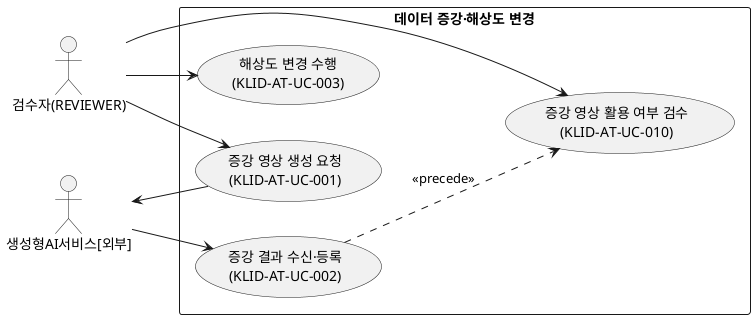
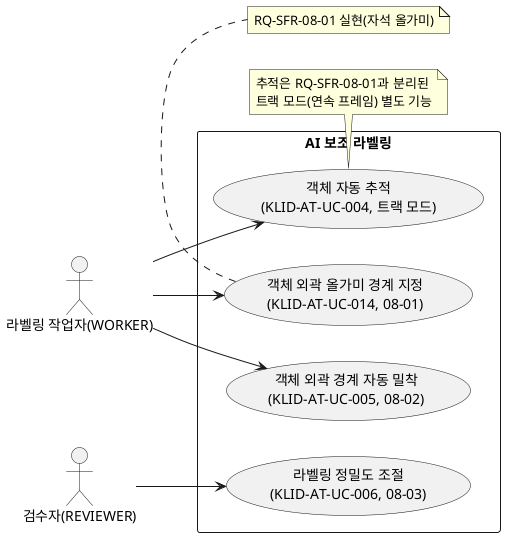
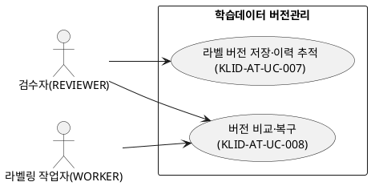
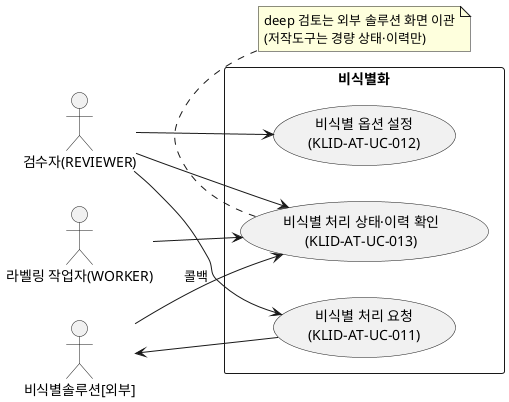
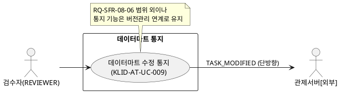

# R2 유스케이스 명세서

> **ID 표기 규칙(공통)**: 본 산출물의 모든 ID(KLID-AT-UC/AC/UCD/SS 등)는 **전체 형식 `KLID-AT-XX-NNN`** 으로 표기한다. 끝부분만(예: `UC-001`) 약식 표기 금지. 범위는 시작 ID만 전체형으로(예: `KLID-AT-UC-001~014`). ※ 요구사항(RQ-SFR-NN-NN) 등 타 체계 ID는 각 체계 원형 유지.
>
> **문서 UC ID는 결번 없는 연속 번호**(KLID-AT-UC-001~014)로 부여한다. LogiCraft 원본 ID(UC-001~011·013·016·017, 결번 012/014/015는 범위 외)와의 매핑은 「R3 요구사항추적표」 및 본 문서 말미 부록에 병기한다.

## 작성 목적
> 시스템의 요구사항에 대하여 액터와 시스템 활동 및 상호간의 활동에 대하여 순서화된 시나리오를 상세하게 기술하고, 유스케이스의 이름, 액터, 그들 간의 연관관계를 보여주는 시스템 환경을 다이어그램으로도 표현한다.

## 작성 방법
> 유스케이스는 시나리오를 구체적인 언어표현으로 기술하고, 유스케이스 다이어그램은 PlantUML로 작성한다.

## 산출물 양식

### 제.개정 이력

| 날짜 | 버전 | 제·개정 내역 | 작성자 | 검토자 |
|------|------|------------|--------|--------|
| 2026-06-04 | 1.0 | LogiCraft 그래프 기반 자동 생성(/cc-doc-gen). 문서 UC ID 결번 없는 연속 번호(KLID-AT-UC-001~014) 부여, LogiCraft 원본 ID 매핑 병기. RQ-SFR-08-01 자석 올가미(UC-014) 반영, 객체 추적(UC-004)은 트랙 모드 별도 기능으로 분리, 06-03 해상도 720p 다운스케일·이미지셋, 08-06 통지(UC-009)는 범위 외이나 버전관리 연계 유지 | 박찬기 | 김현욱 |

### 헤더

| R2 | 유스케이스 명세서 |
|-------|------------|
| 시스템명 | AI 기반 지방정부 CCTV 관제지원시스템 구축(2차) | 서브시스템명 | 학습데이터 저작도구 (AT) |
| 단계명 | 분석 | 작성일자 | 2026-06-04 | 버전 | 1.0 |

### 1. 서브시스템 목록

| 서브시스템 ID | 서브시스템명 | 서브시스템 설명 |
|------------|---------|-----------|
| KLID-AT-SS-004 | 비식별화 | 외부 비식별 솔루션 연동 위탁·결과 수신·상태/이력 표시·옵션 설정 |
| KLID-AT-SS-006 | 라벨링 | AI 보조 라벨링(올가미·외곽 경계 밀착·정밀도 조절·연속 추적) |
| KLID-AT-SS-007 | 검수 | 검수 승인/반려, 데이터마트 수정 통지(outbound) |
| KLID-AT-SS-008 | 버전관리 | 검수 승인 시 라벨 스냅샷 저장, 버전 비교·복구(DB 스냅샷) |
| KLID-AT-SS-009 | 데이터 증강 | 외부 증강 위탁·결과 수신·검수, 해상도 변경(직접 수행) |

### 2. 유스케이스 다이어그램(UCD)

| KLID-AT-UCD-001 | 데이터 증강·해상도 변경 |
|---|---|
| 관련 서브시스템 | KLID-AT-SS-009 데이터 증강 |

| KLID-AT-UCD-002 | AI 보조 라벨링 |
|---|---|
| 관련 서브시스템 | KLID-AT-SS-006 라벨링 |

| KLID-AT-UCD-003 | 학습데이터 버전관리 |
|---|---|
| 관련 서브시스템 | KLID-AT-SS-008 버전관리 |

| KLID-AT-UCD-004 | 비식별화 |
|---|---|
| 관련 서브시스템 | KLID-AT-SS-004 비식별화 |

| KLID-AT-UCD-005 | 데이터마트 통지 |
|---|---|
| 관련 서브시스템 | KLID-AT-SS-007 검수 |

### 3. 유스케이스 목록

| 유스케이스 ID | 유스케이스명 | 유스케이스 설명 | 관련액터 ID | 관련 UCD ID | 관련 요구사항 ID |
|------------|---------|-----------|----------|-----------|-------------|
| KLID-AT-UC-001 | 증강 영상 생성 요청 | 원본 영상에 날씨·계절·시간 증강(WINTER/NIGHT/RAIN) 생성을 외부 생성형 AI에 위탁 요청 | KLID-AT-AC-001, KLID-AT-AC-003 | KLID-AT-UCD-001 | RQ-SFR-07-01 |
| KLID-AT-UC-002 | 증강 결과 수신·등록 | 외부 증강 결과 콜백을 수신해 새 영상(원본 연결)으로 등록하고 원본 라벨 매핑·복사 | KLID-AT-AC-001, KLID-AT-AC-003 | KLID-AT-UCD-001 | RQ-SFR-07-01, RQ-SFR-07-02 |
| KLID-AT-UC-003 | 해상도 변경 수행 | 원본보다 낮은 표준 하위 해상도(예: 720p)로 다운스케일하여 이미지셋 제공(업스케일 불가·좌표 미제공) | KLID-AT-AC-001 | KLID-AT-UCD-001 | RQ-SFR-06-03 |
| KLID-AT-UC-004 | 객체 자동 추적 | 시드 객체를 후속 프레임에서 추론·트랙 보간으로 추적(트랙 모드 별도 기능, 08-01과 분리) | KLID-AT-AC-002 | KLID-AT-UCD-002 | (트랙 모드 — RQ-SFR 직접 종속 없음) |
| KLID-AT-UC-005 | 객체 외곽 경계 자동 밀착 | 클릭/박스 시드를 SAM2에 보내 외곽선 마스크/폴리곤을 산출·밀착 | KLID-AT-AC-002 | KLID-AT-UCD-002 | RQ-SFR-08-02 |
| KLID-AT-UC-006 | 라벨링 정밀도 조절 | 폴리곤 단순화 정밀도(epsilon)를 시스템 설정으로 조절 | KLID-AT-AC-001 | KLID-AT-UCD-002 | RQ-SFR-08-03 |
| KLID-AT-UC-007 | 라벨 버전 저장·이력 추적 | 검수 승인(APPROVED) 시점에 라벨 전체 스냅샷(JSON)을 해시와 함께 적재 | KLID-AT-AC-001 | KLID-AT-UCD-003 | RQ-SFR-08-04 |
| KLID-AT-UC-008 | 버전 비교·복구 | 두 검수완료 스냅샷을 비교(diff)하고 선택 버전을 새 active로 복구 | KLID-AT-AC-001, KLID-AT-AC-002 | KLID-AT-UCD-003 | RQ-SFR-08-05 |
| KLID-AT-UC-009 | 데이터마트 수정 통지 | 검수완료 후 라벨 수정 시 변경 요약만 담은 TASK_MODIFIED를 관제에 단방향 통지 | KLID-AT-AC-001, KLID-AT-AC-005 | KLID-AT-UCD-005 | (RQ-SFR-08-06 범위 외 — 통지 기능 유지) |
| KLID-AT-UC-010 | 증강 영상 활용 여부 검수 | 미검수(PENDING) 증강 영상을 확인해 승인(ACCEPTED)/반려(REJECTED) | KLID-AT-AC-001 | KLID-AT-UCD-001 | RQ-SFR-07-03 |
| KLID-AT-UC-011 | 비식별 처리 요청 | 대상 영상을 외부 비식별 솔루션에 위탁, 비식별본 별도 저장·원본 보존 | KLID-AT-AC-001, KLID-AT-AC-004 | KLID-AT-UCD-004 | RQ-SFR-09-01, RQ-SFR-09-02 |
| KLID-AT-UC-012 | 비식별 옵션 설정 | 외부 비식별 솔루션이 제공하는 옵션을 관리 화면에서 설정·저장 | KLID-AT-AC-001 | KLID-AT-UCD-004 | RQ-SFR-09-04 |
| KLID-AT-UC-013 | 비식별 처리 상태·이력 확인 | 영상 단위 비식별 상태·처리 이력을 화면에서 확인(deep 검토는 외부 솔루션) | KLID-AT-AC-001, KLID-AT-AC-002 | KLID-AT-UCD-004 | RQ-SFR-09-03, RQ-SFR-09-05 |
| KLID-AT-UC-014 | 객체 외곽 올가미 경계 지정 | 객체 외곽을 따라 그리면 엣지에 자동 밀착(자석 올가미)하여 정밀 경계 생성 | KLID-AT-AC-002 | KLID-AT-UCD-002 | RQ-SFR-08-01 |

### 4. 액터 목록

| 액터 ID | 액터명 | 액터유형 (주요/보조/숨은) | 액터설명 |
|--------|------|-------------------|------|
| KLID-AT-AC-001 | 검수자(REVIEWER) | 주요 | 사용자 관리·시스템 설정, 작업 배정, 검수 승인/반려, 증강·비식별·버전 관리 수행 |
| KLID-AT-AC-002 | 라벨링 작업자(WORKER) | 주요 | 라벨 수정·검수 제출, AI 보조 라벨링(올가미·밀착·추적) 사용 |
| KLID-AT-AC-003 | 생성형AI서비스[외부] | 보조 | 날씨·계절·시간 증강 영상을 생성해 콜백으로 반환(본체는 외부 책임) |
| KLID-AT-AC-004 | 비식별솔루션[외부] | 보조 | 영상 개인정보 비식별 처리·결과 콜백·결과 검토화면 제공(발주기관 직접구매) |
| KLID-AT-AC-005 | 관제서버[외부] | 숨은 | 수정 통지(TASK_MODIFIED)를 수신해 데이터마트 재동기화 |

> ※ ai-server(YOLO/SAM2 추론)는 외부 시스템이 아니라 저작도구 내부 구성요소이므로 액터로 표기하지 않고 서브시스템 내부 의존성으로 다룬다.

### 5. 유스케이스 기술서

<table>
<tr><td>유스케이스 ID</td><td>KLID-AT-UC-001</td><td>유스케이스명</td><td>증강 영상 생성 요청</td></tr>
<tr><td colspan="4">
<b>1. 주요 액터</b> &emsp;- 검수자(REVIEWER)  
<b>2. 이해관계자와 관심사항</b> &emsp;- 검수자는 원본 영상에 날씨·계절·시간 변화를 적용한 증강 영상을 확보하길 원한다. &emsp;- 생성형AI서비스[외부]는 위탁 요청을 받아 증강을 수행한다.  
<b>3. 전제조건</b> &emsp;- 원본 영상(RAW_SN)이 존재한다. &emsp;- REVIEWER로 인증되어 있다.  
<b>4. 종료조건</b> &emsp;- 외부 서비스에 증강 작업이 위탁되고 결과 콜백을 대기한다.  
<b>5. 기본 시나리오</b> 
&emsp;1. 검수자가 증강 대상 원본 영상과 증강 종류(WINTER/NIGHT/RAIN)를 선택한다. 
&emsp;2. 시스템이 외부 생성형 AI 서비스에 증강 생성을 위임 요청한다. 
&emsp;3. 외부 서비스가 요청을 수락하고 비동기로 증강을 수행한다(결과는 KLID-AT-UC-002 콜백). 
&emsp;4. 본 유스케이스는 종료한다.  
<b>6. 대안 시나리오</b> &emsp;- (해당 없음)  
<b>7. 구현 시 고려 사항</b> &emsp;- 외부 위탁 유형은 WINTER/NIGHT/RAIN 3종이며 해상도 변경은 KLID-AT-UC-003 내부 수행으로 제외. &emsp;- 외부 연동에 타임아웃·재시도·서킷브레이커(Resilience4j) 적용.  
<b>8. 발생 빈도</b> &emsp;- 중간(증강 데이터 확보 시점에 발생)
</td></tr>
</table>

<table>
<tr><td>유스케이스 ID</td><td>KLID-AT-UC-002</td><td>유스케이스명</td><td>증강 결과 수신·등록</td></tr>
<tr><td colspan="4">
<b>1. 주요 액터</b> &emsp;- 생성형AI서비스[외부], 검수자(REVIEWER)  
<b>2. 이해관계자와 관심사항</b> &emsp;- 검수자는 증강 결과가 원본과 연결되고 라벨이 보존된 채 등록되길 원한다.  
<b>3. 전제조건</b> &emsp;- 원본 영상(parentRawSn)과 라벨/메타가 존재한다. &emsp;- 외부 서비스가 증강 완료 후 콜백을 전송한다.  
<b>4. 종료조건</b> &emsp;- 새 영상(RAW_SN)이 미검수(PENDING)로 등록되고 원본 라벨/메타가 매핑·복사된다.  
<b>5. 기본 시나리오</b> 
&emsp;1. 외부 서비스가 증강 결과를 콜백(HMAC + 멱등키)으로 전송한다. 
&emsp;2. 시스템이 새 영상(RAW_SN)을 생성하고 원본(PARENT_RAW_SN)을 연결한다. 
&emsp;3. 원본 라벨/메타를 새 영상에 매핑·복사하여 좌표·속성을 보존한다. 
&emsp;4. 새 영상을 미검수(PENDING)로 적재한다(이후 KLID-AT-UC-010 검수). 
&emsp;5. 본 유스케이스는 종료한다.  
<b>6. 대안 시나리오</b> 
&emsp;<b>가. 해상도 변경본</b> &emsp;&emsp;1. 원본보다 낮은 해상도로 다운스케일한 이미지셋으로 제공하며 라벨 좌표는 제공하지 않는다(KLID-AT-UC-003 연계). 
&emsp;<b>나. 콜백 검증 실패</b> &emsp;&emsp;1. parentRawSn 부재 또는 페이로드 무효 시 등록을 거부하고 실패를 기록한다.  
<b>7. 구현 시 고려 사항</b> &emsp;- 증강(해상도 동일)은 좌표 불변 복사, 해상도 변경본은 좌표 미제공. &emsp;- 멱등키로 콜백 중복 방지.  
<b>8. 발생 빈도</b> &emsp;- 중간(증강 요청 건마다 1회 콜백)
</td></tr>
</table>

<table>
<tr><td>유스케이스 ID</td><td>KLID-AT-UC-003</td><td>유스케이스명</td><td>해상도 변경 수행</td></tr>
<tr><td colspan="4">
<b>1. 주요 액터</b> &emsp;- 검수자(REVIEWER)  
<b>2. 이해관계자와 관심사항</b> &emsp;- 검수자는 학습데이터 다양화를 위해 영상을 낮은 해상도 이미지셋으로 변환하길 원한다.  
<b>3. 전제조건</b> &emsp;- 원본 영상과 라벨이 존재한다. &emsp;- REVIEWER로 인증되어 있다.  
<b>4. 종료조건</b> &emsp;- 원본보다 낮은 해상도의 이미지셋이 생성된다(라벨 좌표 미제공, 원본 보존).  
<b>5. 기본 시나리오</b> 
&emsp;1. 검수자가 해상도 변경 대상 영상과 목표 하위 해상도(예: 720p)를 지정한다. 
&emsp;2. 시스템이 원본보다 낮은 해상도로 프레임 이미지를 다운스케일한다(업스케일 요청은 거부). 
&emsp;3. 결과를 이미지셋으로 제공한다(영상 재생성 없음, 라벨 좌표 미제공, 원본 미변경). 
&emsp;4. 본 유스케이스는 종료한다.  
<b>6. 대안 시나리오</b> 
&emsp;<b>가. 업스케일 요청</b> &emsp;&emsp;1. 원본보다 높은 해상도 요청은 400으로 거부한다.  
<b>7. 구현 시 고려 사항</b> &emsp;- 이미지 확대·축소 등 생성형 변형 본체는 외부 시스템 책임(범위 외). &emsp;- 산출물은 이미지셋만 제공하고 영상(비디오)은 재생성하지 않는다.  
<b>8. 발생 빈도</b> &emsp;- 낮음(필요 시 선택 수행)
</td></tr>
</table>

<table>
<tr><td>유스케이스 ID</td><td>KLID-AT-UC-004</td><td>유스케이스명</td><td>객체 자동 추적</td></tr>
<tr><td colspan="4">
<b>1. 주요 액터</b> &emsp;- 라벨링 작업자(WORKER)  
<b>2. 이해관계자와 관심사항</b> &emsp;- 작업자는 한 번 지정한 객체가 후속 프레임에서 자동 추적되어 라벨링 시간을 줄이길 원한다.  
<b>3. 전제조건</b> &emsp;- 인증(REVIEWER/WORKER)되어 있고 대상 프레임(SRC_SN)과 추적 시작 객체가 존재한다.  
<b>4. 종료조건</b> &emsp;- 후속 프레임에 추적된 객체 위치·경계가 갱신·저장된다.  
<b>5. 기본 시나리오</b> 
&emsp;1. 작업자가 추적할 객체(시드 마스크/박스)와 추적 구간을 지정한다. 
&emsp;2. 시스템이 ai-server(SAM2)에 추론을 요청한다. 
&emsp;3. ai-server가 구간 프레임별 위치·경계를 추론·반환한다. 
&emsp;4. 트랙 보간 알고리즘으로 빈 프레임을 보간해 응답을 구성한다. 
&emsp;5. 결과를 캔버스에 표시하고 사용자가 저장하면 라벨로 반영한다. 
&emsp;6. 본 유스케이스는 종료한다.  
<b>6. 대안 시나리오</b> 
&emsp;<b>가. ai-server 호출 실패/타임아웃</b> &emsp;&emsp;1. 서킷 브레이커 동작, 사용자에게 추적 실패 안내(원본 라벨 유지). 
&emsp;<b>나. 추적 결과 부정확</b> &emsp;&emsp;1. 사용자가 키프레임을 수동 보정 후 보간 재계산.  
<b>7. 구현 시 고려 사항</b> &emsp;- 본 유스케이스는 연속 프레임 추적(트랙 모드, DFEAT-020) 도메인 기능을 실현하며, RQ-SFR-08-01(자석 올가미, KLID-AT-UC-014)과는 구분된 별도 기능이다. &emsp;- 오토라벨링은 원본에만 실행하고 비식별본은 좌표를 공유한다.  
<b>8. 발생 빈도</b> &emsp;- 중간(연속 프레임 라벨링 시)
</td></tr>
</table>

<table>
<tr><td>유스케이스 ID</td><td>KLID-AT-UC-005</td><td>유스케이스명</td><td>객체 외곽 경계 자동 밀착</td></tr>
<tr><td colspan="4">
<b>1. 주요 액터</b> &emsp;- 라벨링 작업자(WORKER)  
<b>2. 이해관계자와 관심사항</b> &emsp;- 작업자는 클릭/박스 한 번으로 객체 외곽 경계가 자동으로 잡히길 원한다.  
<b>3. 전제조건</b> &emsp;- 인증되어 있고 대상 프레임(SRC_SN)과 초기 시드(클릭/박스)가 존재한다.  
<b>4. 종료조건</b> &emsp;- 객체 외곽선에 밀착된 폴리곤/마스크 좌표가 반환된다.  
<b>5. 기본 시나리오</b> 
&emsp;1. 작업자가 객체 주변에 대략의 시드(박스/클릭)를 지정한다. 
&emsp;2. 시스템이 시드를 ai-server(SAM2)에 송신한다. 
&emsp;3. ai-server가 외곽선 기반 마스크/폴리곤을 산출·반환한다. 
&emsp;4. 응답 폴리곤을 외곽선 밀착 형태로 구성해 캔버스에 적용한다. 
&emsp;5. 본 유스케이스는 종료한다.  
<b>6. 대안 시나리오</b> 
&emsp;<b>가. 외곽 인식 실패</b> &emsp;&emsp;1. 사용자가 수동 폴리곤으로 전환해 작업한다. 
&emsp;<b>나. 추론 호출 실패</b> &emsp;&emsp;1. 503 안내, 기존 시드 유지.  
<b>7. 구현 시 고려 사항</b> &emsp;- 클릭/박스 중 최소 1개 시드 필요. MASK↔RLE↔Polygon 변환(CVAT 포팅) 사용. &emsp;- 클릭/박스 1회 자동 분할로, 외곽을 따라 그리는 올가미(KLID-AT-UC-014)와 인터랙션 방식이 다르다.  
<b>8. 발생 빈도</b> &emsp;- 높음(객체 라벨링 시 상시)
</td></tr>
</table>

<table>
<tr><td>유스케이스 ID</td><td>KLID-AT-UC-006</td><td>유스케이스명</td><td>라벨링 정밀도 조절</td></tr>
<tr><td colspan="4">
<b>1. 주요 액터</b> &emsp;- 검수자(REVIEWER)  
<b>2. 이해관계자와 관심사항</b> &emsp;- 검수자는 경계 세밀함(폴리곤 점 수)을 조절해 라벨 품질을 제어하길 원한다.  
<b>3. 전제조건</b> &emsp;- REVIEWER로 인증되어 있고 폴리곤 단순화 설정 키가 존재한다.  
<b>4. 종료조건</b> &emsp;- 조절된 정밀도가 적용된 라벨 결과가 반환된다.  
<b>5. 기본 시나리오</b> 
&emsp;1. 검수자가 시스템 설정에서 폴리곤 단순화 정밀도(POLYGON_SIMPLIFY_TOLERANCE)를 조절한다. 
&emsp;2. 시스템이 설정값을 저장하고 캐시(TTL 60s)에 반영한다. 
&emsp;3. 이후 SAM2 밀착/추적 시 설정 epsilon으로 폴리곤 점 수를 단순화한다. 
&emsp;4. 본 유스케이스는 종료한다.  
<b>6. 대안 시나리오</b> 
&emsp;<b>가. 값 범위 초과</b> &emsp;&emsp;1. 입력 검증으로 400 반환·안내. 
&emsp;<b>나. 권한 부족</b> &emsp;&emsp;1. 설정 변경은 REVIEWER 전용이므로 403 반환.  
<b>7. 구현 시 고려 사항</b> &emsp;- 설정 조회 실패 시 기본값(1.0px)으로 fail-safe 폴백. 변경 빈도 낮아 캐시.  
<b>8. 발생 빈도</b> &emsp;- 낮음(설정 변경 시점에만)
</td></tr>
</table>

<table>
<tr><td>유스케이스 ID</td><td>KLID-AT-UC-007</td><td>유스케이스명</td><td>라벨 버전 저장·이력 추적</td></tr>
<tr><td colspan="4">
<b>1. 주요 액터</b> &emsp;- 검수자(REVIEWER)  
<b>2. 이해관계자와 관심사항</b> &emsp;- 검수자는 검수 완료된 학습데이터를 버전으로 보존하고 이력을 추적하길 원한다.  
<b>3. 전제조건</b> &emsp;- 대상 영상의 라벨이 검수 제출되어 검수 대기 상태다. &emsp;- REVIEWER로 인증되어 있다.  
<b>4. 종료조건</b> &emsp;- 검수 승인된 라벨 스냅샷이 버전 해시로 식별되어 DB에 적재된다.  
<b>5. 기본 시나리오</b> 
&emsp;1. 검수자가 영상 단위 검수를 승인(APPROVED) 처리한다. 
&emsp;2. 시스템이 승인 시점에 라벨 전체 스냅샷(JSON)을 적재한다(SAVE_REASON='APPROVED'). 
&emsp;3. 페이로드 SHA-256(VERSION_HASH)로 버전을 식별한다(동일 페이로드는 동일 해시). 
&emsp;4. 변경이력을 기록한다. 
&emsp;5. 본 유스케이스는 종료한다.  
<b>6. 대안 시나리오</b> &emsp;- (해당 없음)  
<b>7. 구현 시 고려 사항</b> &emsp;- 라벨 저장 시점에는 버전을 생성하지 않으며, 검수완료로 확정된 단위만 버전 대상이다. &emsp;- 외부 VCS 미사용 DB 스냅샷 방식.  
<b>8. 발생 빈도</b> &emsp;- 중간(검수 승인 건마다 1회)
</td></tr>
</table>

<table>
<tr><td>유스케이스 ID</td><td>KLID-AT-UC-008</td><td>유스케이스명</td><td>버전 비교·복구</td></tr>
<tr><td colspan="4">
<b>1. 주요 액터</b> &emsp;- 검수자(REVIEWER), 라벨링 작업자(WORKER)  
<b>2. 이해관계자와 관심사항</b> &emsp;- 검수자는 버전 간 차이를 비교하고 필요 시 이전 버전으로 복구하길 원한다.  
<b>3. 전제조건</b> &emsp;- 대상 프레임(SRC_SN)에 2개 이상 라벨 버전 스냅샷이 존재한다. &emsp;- 인증되어 있다.  
<b>4. 종료조건</b> &emsp;- diff가 표시되거나 선택 버전이 새 active 버전으로 복원된다.  
<b>5. 기본 시나리오</b> 
&emsp;1. 사용자가 버전 이력을 조회한다. 
&emsp;2. 두 버전(기준/대상 해시)의 차이를 요청한다. 
&emsp;3. 두 DB 스냅샷을 앱에서 비교해 ADDED/MODIFIED/REMOVED diff를 산출·표시한다. 
&emsp;4. 사용자가 대상 버전으로 복구를 요청한다. 
&emsp;5. 대상 스냅샷을 새 active 버전으로 복원·기록한다. 
&emsp;6. 본 유스케이스는 종료한다.  
<b>6. 대안 시나리오</b> 
&emsp;<b>가. 동일 페이로드 버전</b> &emsp;&emsp;1. 두 버전 해시 동일 시 변경 없음으로 안내. 
&emsp;<b>나. 검수 완료 후 복구</b> &emsp;&emsp;1. 복구로 라벨이 변경되면 KLID-AT-UC-009(데이터마트 수정 통지)를 트리거.  
<b>7. 구현 시 고려 사항</b> &emsp;- 비교/복구는 검수완료(APPROVED) 스냅샷 기준. REVIEWER 전체 / WORKER 본인 배정. 응답 diff 최대 500건. &emsp;- IDOR·비관적 잠금으로 소유 검증·동시성 제어.  
<b>8. 발생 빈도</b> &emsp;- 낮음(비교·복구 필요 시)
</td></tr>
</table>

<table>
<tr><td>유스케이스 ID</td><td>KLID-AT-UC-009</td><td>유스케이스명</td><td>데이터마트 수정 통지</td></tr>
<tr><td colspan="4">
<b>1. 주요 액터</b> &emsp;- 검수자(REVIEWER), 관제서버[외부]  
<b>2. 이해관계자와 관심사항</b> &emsp;- 관제서버는 검수완료 후 라벨이 수정되면 데이터마트를 최신으로 재동기화하길 원한다.  
<b>3. 전제조건</b> &emsp;- 대상 영상(RAW_SN)이 검수 완료(APPROVED) 이력을 가진다. &emsp;- 검수 완료 후 라벨/메타 수정이 발생했다.  
<b>4. 종료조건</b> &emsp;- TASK_MODIFIED 통지(수정 요약만)가 멱등 발행된다(PII/본문 미포함).  
<b>5. 기본 시나리오</b> 
&emsp;1. 검수 완료 후 라벨/메타가 수정된다. 
&emsp;2. 변경 프레임 목록(SRC_SN+변경 종류)·요약 카운트를 구성한다. 
&emsp;3. 외부 통지 연동이 TASK_MODIFIED를 관제서버에 비동기 push한다. 
&emsp;4. 관제서버가 조회 API로 상세를 가져가 재동기화(UPSERT)한다. 
&emsp;5. 본 유스케이스는 종료한다.  
<b>6. 대안 시나리오</b> 
&emsp;<b>가. 통지 전송 실패</b> &emsp;&emsp;1. dead-letter/재등록 큐 적재 후 후속 재시도. 
&emsp;<b>나. 동일 트랜잭션 다수 변경</b> &emsp;&emsp;1. 디바운스 후 영상 1건 단위 1회 통지.  
<b>7. 구현 시 고려 사항</b> &emsp;- RQ-SFR-08-06은 요구사항 범위 외(deprecated)이나, 본 통지 기능은 검수완료 후 수정 흐름(버전관리 RQ-SFR-08-04/05 연계)으로 운영 유지된다. &emsp;- 양방향 M2M 미운영, 단방향 outbound + inbound 조회 API 패턴.  
<b>8. 발생 빈도</b> &emsp;- 낮음(검수완료 후 수정 시에만)
</td></tr>
</table>

<table>
<tr><td>유스케이스 ID</td><td>KLID-AT-UC-010</td><td>유스케이스명</td><td>증강 영상 활용 여부 검수</td></tr>
<tr><td colspan="4">
<b>1. 주요 액터</b> &emsp;- 검수자(REVIEWER)  
<b>2. 이해관계자와 관심사항</b> &emsp;- 검수자는 증강 결과를 확인해 학습데이터로 쓸지 판단하길 원한다.  
<b>3. 전제조건</b> &emsp;- 증강 영상이 미검수(PENDING)로 등록되어 있다(KLID-AT-UC-002 완료). &emsp;- REVIEWER로 인증되어 있다.  
<b>4. 종료조건</b> &emsp;- 증강 영상이 ACCEPTED(활용) 또는 REJECTED(미활용)로 전이된다.  
<b>5. 기본 시나리오</b> 
&emsp;1. 검수자가 PENDING 증강 결과를 조회한다. 
&emsp;2. 증강 결과(영상·복사된 라벨)를 확인한다. 
&emsp;3. 활용 가능 시 승인한다(PENDING→ACCEPTED). 
&emsp;4. 부적합 시 사유를 입력해 반려한다(PENDING→REJECTED). 
&emsp;5. 본 유스케이스는 종료한다.  
<b>6. 대안 시나리오</b> 
&emsp;<b>가. 상태 충돌</b> &emsp;&emsp;1. PENDING 이외 상태 전이 요청은 409 CONFLICT 반환. 
&emsp;<b>나. 사유 누락</b> &emsp;&emsp;1. 반려 사유가 비어있으면 400으로 거부.  
<b>7. 구현 시 고려 사항</b> &emsp;- 증강 본체는 외부 SFR-07 책임, 저작도구는 결과 검수만 담당. 승인 시 데이터마트 View 노출(APPROVED)과 연계.  
<b>8. 발생 빈도</b> &emsp;- 중간(증강 결과 등록 건마다)
</td></tr>
</table>

<table>
<tr><td>유스케이스 ID</td><td>KLID-AT-UC-011</td><td>유스케이스명</td><td>비식별 처리 요청</td></tr>
<tr><td colspan="4">
<b>1. 주요 액터</b> &emsp;- 검수자(REVIEWER), 비식별솔루션[외부]  
<b>2. 이해관계자와 관심사항</b> &emsp;- 검수자는 수집 영상의 개인정보를 안전하게 비식별 처리하길 원한다.  
<b>3. 전제조건</b> &emsp;- 대상 영상이 비식별 대상이다. &emsp;- REVIEWER 인증 + 외부 비식별 솔루션 가용.  
<b>4. 종료조건</b> &emsp;- 비식별본이 별도 경로에 저장되고 원본 보존, 처리 이력이 영상 단위로 기록된다.  
<b>5. 기본 시나리오</b> 
&emsp;1. 검수자가 비식별(재)처리를 요청한다. 
&emsp;2. 시스템이 외부 비식별 API를 호출한다. 
&emsp;3. 외부 솔루션이 결과를 콜백(HMAC, 멱등키)으로 반환한다. 
&emsp;4. 비식별본을 별도 경로(STORAGE_DEIDENTIFIED_PATH)에 저장하고 원본은 유지한다. 
&emsp;5. 처리 이력(DE_IDNTF_YN 등)을 기록한다. 
&emsp;6. 본 유스케이스는 종료한다.  
<b>6. 대안 시나리오</b> 
&emsp;<b>가. 비식별 API 실패</b> &emsp;&emsp;1. DE_IDNTF_YN='F' 마킹, 재시도 큐 등록, 원본 보존. 
&emsp;<b>나. 비식별 비대상</b> &emsp;&emsp;1. 비식별 미호출, 원본만 저장.  
<b>7. 구현 시 고려 사항</b> &emsp;- 외부 솔루션은 발주기관 직접구매 제공. SSRF 차단·출력 경로 강제·원본 절대 삭제 금지. 결과 콜백은 HMAC+멱등. &emsp;- 설계 타깃은 전체 영상 비식별 선두 → 비식별 영상 대상 마킹.  
<b>8. 발생 빈도</b> &emsp;- 높음(수집 영상 적재 시 파이프라인 선두 단계)
</td></tr>
</table>

<table>
<tr><td>유스케이스 ID</td><td>KLID-AT-UC-012</td><td>유스케이스명</td><td>비식별 옵션 설정</td></tr>
<tr><td colspan="4">
<b>1. 주요 액터</b> &emsp;- 검수자(REVIEWER)  
<b>2. 이해관계자와 관심사항</b> &emsp;- 검수자는 외부 비식별 솔루션이 제공하는 옵션을 UI에서 설정하길 원한다.  
<b>3. 전제조건</b> &emsp;- REVIEWER로 인증되어 있다.  
<b>4. 종료조건</b> &emsp;- 비식별 옵션이 저장되어 이후 요청에 반영된다.  
<b>5. 기본 시나리오</b> 
&emsp;1. 검수자가 관리 화면에서 비식별 옵션을 설정한다. 
&emsp;2. 시스템이 옵션을 저장하고 이후 비식별 요청에 적용한다. 
&emsp;3. 본 유스케이스는 종료한다.  
<b>6. 대안 시나리오</b> &emsp;- (해당 없음)  
<b>7. 구현 시 고려 사항</b> &emsp;- 설정 가능한 옵션 항목은 외부 비식별 솔루션 계약에 종속(미확정 항목은 보완 예정).  
<b>8. 발생 빈도</b> &emsp;- 낮음(설정 시점에만)
</td></tr>
</table>

<table>
<tr><td>유스케이스 ID</td><td>KLID-AT-UC-013</td><td>유스케이스명</td><td>비식별 처리 상태·이력 확인</td></tr>
<tr><td colspan="4">
<b>1. 주요 액터</b> &emsp;- 검수자(REVIEWER), 라벨링 작업자(WORKER)  
<b>2. 이해관계자와 관심사항</b> &emsp;- 검수자/작업자는 영상 단위 비식별 처리 상태와 이력을 화면에서 확인하길 원한다.  
<b>3. 전제조건</b> &emsp;- 영상이 적재되어 배치 파이프라인 대상이다. &emsp;- 인증되어 있다(REVIEWER 또는 WORKER).  
<b>4. 종료조건</b> &emsp;- 영상 단위 비식별 처리 상태(DE_IDNTF_YN)와 배치 비식별 단계가 화면에서 확인되고, 처리 이력이 기록되어 있다.  
<b>5. 기본 시나리오</b> 
&emsp;1. 사용자가 영상 상세 화면 또는 처리 현황 화면에 진입한다. 
&emsp;2. 영상 상세에서 개인정보 분류와 배치 처리 단계(비식별 포함)를 확인한다. 
&emsp;3. 처리 현황 화면에서 영상별 배치 단계와 진행/실패 상태를 확인한다. 
&emsp;4. 외부 비식별 SW가 완료/실패를 콜백하면 시스템이 DE_IDNTF_YN을 Y/F로 갱신하고 처리 이력을 기록한다. 
&emsp;5. 본 유스케이스는 종료한다.  
<b>6. 대안 시나리오</b> 
&emsp;<b>가. 비식별 처리 실패</b> &emsp;&emsp;1. DE_IDNTF_YN을 F로 마킹하고, 처리 이력에 FAILED 상태·오류 코드를 기록하며, 배치 단계는 FAILED로 표시한다.  
<b>7. 구현 시 고려 사항</b> &emsp;- 원본/비식별 좌우 비교 등 deep 검토·검증 UI와 처리 이력 상세 조회 전용 화면/API는 외부 비식별 솔루션으로 이관(범위 외). &emsp;- 저작도구는 상태(영상 상세/현황 화면 노출)·이력(기록)만 보유.  
<b>8. 발생 빈도</b> &emsp;- 중간(영상 처리 현황 확인 시)
</td></tr>
</table>

<table>
<tr><td>유스케이스 ID</td><td>KLID-AT-UC-014</td><td>유스케이스명</td><td>객체 외곽 올가미 경계 지정</td></tr>
<tr><td colspan="4">
<b>1. 주요 액터</b> &emsp;- 라벨링 작업자(WORKER)  
<b>2. 이해관계자와 관심사항</b> &emsp;- 작업자는 객체 외곽을 따라 그리면 경계에 자동으로 달라붙어 정밀 경계를 빠르게 잡길 원한다.  
<b>3. 전제조건</b> &emsp;- 인증(REVIEWER/WORKER)되어 있고 대상 프레임(SRC_SN)이 본인 배정이다. &emsp;- 객체 외곽에 식별 가능한 엣지·대비가 있다.  
<b>4. 종료조건</b> &emsp;- 객체 외곽 경계 폴리곤이 라벨로 저장되고 위치·경계 정확도가 향상된다.  
<b>5. 기본 시나리오</b> 
&emsp;1. 작업자가 캔버스에서 자석 올가미 도구를 선택한다. 
&emsp;2. 객체 외곽을 따라 커서를 이동하여 외곽선을 그린다. 
&emsp;3. 엣지 검출 기반으로 그리는 경로가 객체 경계에 자동 밀착(스냅)된다. 
&emsp;4. 필요 시 경계를 미세조정하고 확정한다. 
&emsp;5. 확정된 폴리곤 경계를 라벨로 저장한다. 
&emsp;6. 본 유스케이스는 종료한다.  
<b>6. 대안 시나리오</b> 
&emsp;<b>가. 저대비·흐릿한 경계로 스냅 부정확</b> &emsp;&emsp;1. 스냅이 부정확하면 작업자가 점을 수동 추가·이동하여 경계를 보정한다. 
&emsp;<b>나. 본인 미배정 프레임 접근</b> &emsp;&emsp;1. 403으로 차단한다(IDOR 방지).  
<b>7. 구현 시 고려 사항</b> &emsp;- RQ-SFR-08-01을 자석 올가미(엣지 자동 스냅, CVAT intelligent scissors 패턴)로 실현한다. &emsp;- 비디오 프레임 추적이 아니라 단일 프레임 인터랙티브 경계 도구이며, 연속 프레임 추적(KLID-AT-UC-004)과 구분된다.  
<b>8. 발생 빈도</b> &emsp;- 높음(객체 경계 라벨링 시 상시)
</td></tr>
</table>

## 항목 설명

- **서브시스템 ID/명/설명**: CLAUDE.md 도메인 구조 기반 서브시스템 식별·명칭·간략 설명.
- **유스케이스 ID/명/설명**: 유스케이스 식별·명칭·간략 설명(문서 연속 ID 부여).
- **관련액터/UCD/요구사항 ID**: 연결된 액터·UCD·R1 요구사항 ID.
- **유스케이스 기술서**: 주요 액터·이해관계자·전제/종료조건·기본/대안 시나리오·구현 고려사항·발생 빈도.

## 부록 A. 문서 UC ID ↔ LogiCraft 원본 ID 매핑

> 문서 산출물은 결번 없는 연속 ID(KLID-AT-UC-001~014)를 사용한다. 추적성 보존을 위해 LogiCraft 원본 ID와의 매핑을 병기한다.

| 문서 ID | LogiCraft 원본 | 유스케이스명 | 관련 요구사항 |
|---------|:---:|---------|---------|
| KLID-AT-UC-001 | UC-001 | 증강 영상 생성 요청 | RQ-SFR-07-01 |
| KLID-AT-UC-002 | UC-002 | 증강 결과 수신·등록 | RQ-SFR-07-01/02 |
| KLID-AT-UC-003 | UC-003 | 해상도 변경 수행 | RQ-SFR-06-03 |
| KLID-AT-UC-004 | UC-004 | 객체 자동 추적 | (트랙 모드) |
| KLID-AT-UC-005 | UC-005 | 객체 외곽 경계 자동 밀착 | RQ-SFR-08-02 |
| KLID-AT-UC-006 | UC-006 | 라벨링 정밀도 조절 | RQ-SFR-08-03 |
| KLID-AT-UC-007 | UC-007 | 라벨 버전 저장·이력 추적 | RQ-SFR-08-04 |
| KLID-AT-UC-008 | UC-008 | 버전 비교·복구 | RQ-SFR-08-05 |
| KLID-AT-UC-009 | UC-009 | 데이터마트 수정 통지 | RQ-SFR-08-06(범위 외, 통지 유지) |
| KLID-AT-UC-010 | UC-010 | 증강 영상 활용 여부 검수 | RQ-SFR-07-03 |
| KLID-AT-UC-011 | UC-011 | 비식별 처리 요청 | RQ-SFR-09-01/02 |
| KLID-AT-UC-012 | **UC-013** | 비식별 옵션 설정 | RQ-SFR-09-04 |
| KLID-AT-UC-013 | **UC-016** | 비식별 처리 상태·이력 확인 | RQ-SFR-09-03/05 |
| KLID-AT-UC-014 | **UC-017** | 객체 외곽 올가미 경계 지정 | RQ-SFR-08-01 |

## 부록 B. 결번(범위 외 제외) 안내

> LogiCraft 원본 UC-012/014/015는 아래 사유로 범위 외(deprecated) 처리되어 본 명세서에서 제외했다. 문서 연속 ID에는 포함되지 않는다.

| LogiCraft 원본 | 제목 | 제외 사유 |
|:---:|---------|---------|
| UC-012 | 비식별 결과·이력 검토 | 비식별 처리 결과의 deep 검토(원본/비식별 비교 등)를 외부 비식별 솔루션으로 이관. 저작도구 몫(경량 상태·이력)은 KLID-AT-UC-013으로 대체 |
| UC-014 | 개인정보 보호대책 적용 | RQ-SFR-09-06 범위 외 삭제 연동 — 보안·인프라 책임. 민감정보 보호는 NFR-005로 유지 |
| UC-015 | 개인정보 유형 분류체계 관리 | RQ-SFR-09-07 범위 외 삭제 연동 — 보안·인프라 책임 |
