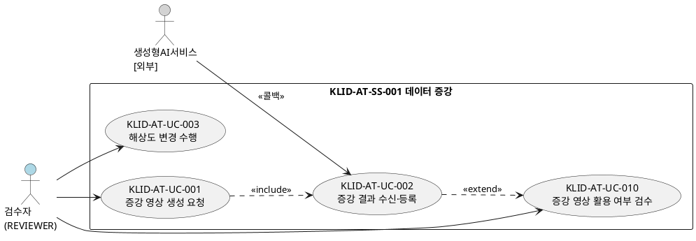
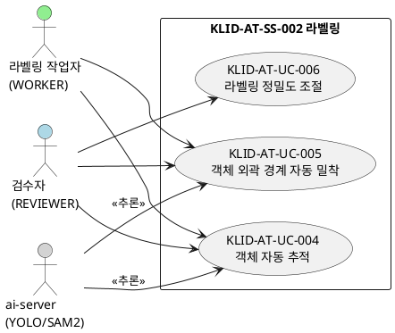
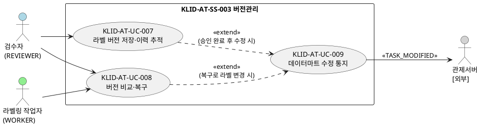
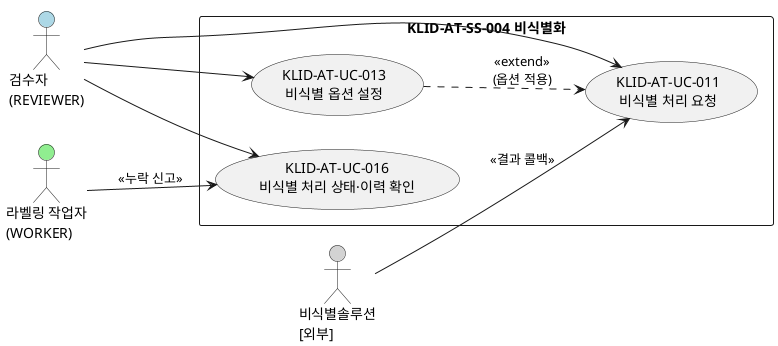
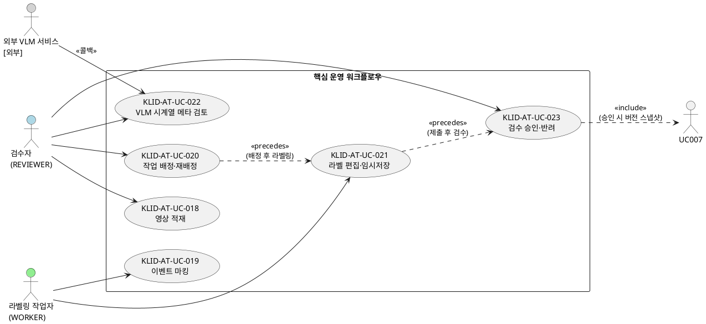
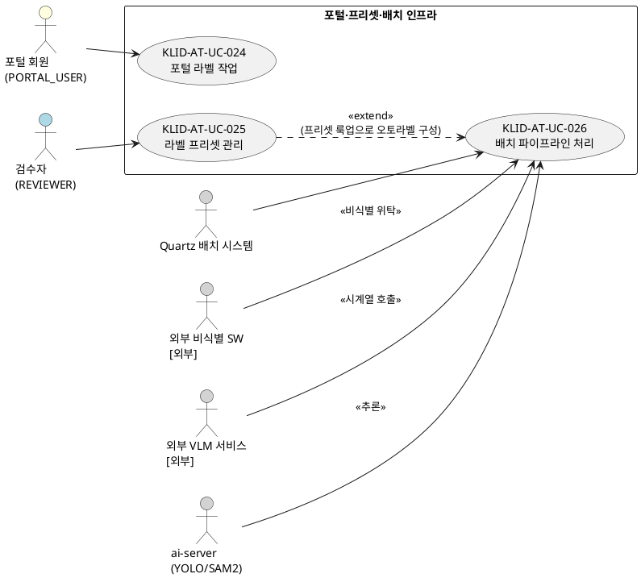

# R2 유스케이스 명세서

> **ID 표기 규칙(공통)**: 본 산출물의 모든 ID(KLID-AT-UC/CO/DC/DCD/SD/SC/AC/EN/ERD/TB/II/IC/IF/UCD/ACT 등)는 **전체 형식 `KLID-AT-XX-NNN`** 으로 표기한다. 끝부분만(예: `UC-001`) 약식 표기 금지. 나열·범위 모두 각 ID를 전체형으로 표기한다(예: `KLID-AT-UC-001 ~ KLID-AT-UC-013`). ※ 요구사항(RQ-SFR-NN-NN)·시스템시험(KLID-ST-NNN) 등 타 체계 ID는 각 체계 원형 유지.

## 작성 목적
> 시스템의 요구사항에 대하여 액터와 시스템 활동 및 상호간의 활동에 대하여 순서화된 시나리오를 상세하게 기술하고, 유스케이스의 이름, 액터, 그들 간의 연관관계를 보여주는 시스템 환경을 다이어그램으로도 표현한다. 또한 주요한 유스케이스에 대하여 대상 시스템과 액터 간의 오퍼레이션을 상세하게 표시하는 시스템 시퀀스 다이어그램 및 오퍼레이션의 약정을 나타낼 수 있는데 이 부분은 필수 산출물에 포함되지 않으며 선택적으로 작성할 수 있다.

## 작성 방법
> 유스케이스는 시나리오를 구체적인 언어표현으로 기술하고, 유스케이스 다이어그램은 그림으로 작성하며 작성도구를 사용할 수 있다.

## 산출물 양식

### 제·개정 이력

| 날짜 | 버전 | 제·개정 내역 | 작성자 | 검토자 |
|------|------|------------|--------|--------|
| 2026-06-05 | 1.0 | LogiCraft 그래프 기반 자동 생성 (/cc-doc-gen) — R1 기능 요구사항 범위(SFR 실현 UC 13건), 서브시스템·액터 연속 채번 체계(구 문서 v1.2 확정 컨벤션) 계승 | /cc-doc-gen | - |
| 2026-06-05 | 1.1 | **KLID-AT-UC-011 비식별 호출 조건을 확정 규칙으로 교체** — 구 규칙('PRVC/PSDO만 비식별, ANONY 미호출') 기술을 전체 영상 비식별(ANONY 포함, 파이프라인 선두)로 정정 | 박찬기 | - |
| 2026-06-05 | 1.2 | **내부 관리 표기 정화** — 도구 관리 메모·커밋 해시·테스트 세부(mock)·구현 현황 비고(planned)를 제거 또는 설계 서술로 교체 (제출 문서 부적합 표기 정리) | 박찬기 | - |
| 2026-06-05 | 1.3 | **유스케이스 확대 — 핵심 운영 워크플로우·포털·프리셋·배치 9건(KLID-AT-UC-018~026) 신설** — D8 소유 테이블 전수 매핑 정합의 선행 작업으로, RQ-SFR-08(저작도구 핵심 기능)에 흡수돼 개별 UC로 분해되지 않았던 적재·마킹·배정·라벨편집·메타검토·검수·포털·프리셋·배치를 유스케이스로 분해. UCD 2건(KLID-AT-UCD-005·006)·액터 3건(KLID-AT-ACT-008~010 포털 회원·Quartz 배치·외부 VLM) 추가. 마킹·배치에 설계 타깃(비식별 선두) vs 현행 코드 divergence 주석 명시. UC-023 승인→UC-007 버전 스냅샷 include 관계 등재. 유스케이스 13→22건, UCD 4→6건, 액터 7→10건 | 박찬기 | - |

### 헤더

| R2 | 유스케이스 명세서 |
|----|----------------|
| 시스템명 | AI 기반 지방정부 CCTV 관제지원시스템 구축(2차) | 서브시스템명 | 학습데이터 저작도구 (AT) |
| 단계명 | 분석 | 작성일자 | 2026-06-05 | 버전 | 1.3 |

---

## 1. 서브시스템 목록

> R1 기능 요구사항(RQ-SFR-06-03, 07-01~03, 08-01~05, 09-01~05)이 실현되는 서브시스템만 기재하며, **서브시스템 ID는 본 명세서에서 001부터 연속 채번**한다. 그 외 서브시스템(사용자/권한·마킹·배치 파이프라인·시계열 메타·검수·포털)은 R1 기능 요구사항 직접 대응(전용 SFR)이 없어 서브시스템 ID는 부여하지 않는다. 다만 이들 도메인의 핵심 운영 워크플로우(적재·마킹·배정·라벨편집·메타검토·검수·포털·프리셋·배치)는 RQ-SFR-08(저작도구 핵심 기능)에 흡수된 기능으로서 §3 유스케이스(KLID-AT-UC-018~026)와 §2 UCD(KLID-AT-UCD-005·006)로 모델링한다.

| 서브시스템 ID | 서브시스템명 | 서브시스템 설명 |
|-------------|------------|--------------|
| KLID-AT-SS-001 | 데이터 증강 | 외부 생성형 AI 증강 요청·콜백 수신, 증강 영상 등록·검수, 해상도 변경 |
| KLID-AT-SS-002 | 라벨링 | konva.js 캔버스 라벨링, 바운딩박스/폴리곤/세그멘테이션, AI 보조(SAM2·YOLO), 정밀도 조절 |
| KLID-AT-SS-003 | 버전관리 | 검수 승인 시 DB 스냅샷 적재, 버전 diff·rollback, 수정 통지(TASK_MODIFIED) |
| KLID-AT-SS-004 | 비식별화 | 외부 비식별 솔루션 연동, 비식별 옵션 설정, 비식별 누락 신고·해소 |

---

## 2. 유스케이스 다이어그램(UCD)

### KLID-AT-UCD-001: 데이터 증강·해상도 변경

| UCD ID | KLID-AT-UCD-001 | UCD 명 | 데이터 증강·해상도 변경 |
|--------|----------------|-------|----------------------|
| 관련 서브시스템 ID | KLID-AT-SS-001 | 관련 서브시스템명 | 데이터 증강 |

---

### KLID-AT-UCD-002: AI 라벨링 보조(VOS·분할·정밀도)

| UCD ID | KLID-AT-UCD-002 | UCD 명 | AI 라벨링 보조(VOS·분할·정밀도) |
|--------|----------------|-------|-------------------------------|
| 관련 서브시스템 ID | KLID-AT-SS-002 | 관련 서브시스템명 | 라벨링 |

---

### KLID-AT-UCD-003: 버전관리·수정 통지

| UCD ID | KLID-AT-UCD-003 | UCD 명 | 버전관리·수정 통지 |
|--------|----------------|-------|------------------|
| 관련 서브시스템 ID | KLID-AT-SS-003 | 관련 서브시스템명 | 버전관리 |

---

### KLID-AT-UCD-004: 비식별화

| UCD ID | KLID-AT-UCD-004 | UCD 명 | 비식별화 |
|--------|----------------|-------|---------|
| 관련 서브시스템 ID | KLID-AT-SS-004 | 관련 서브시스템명 | 비식별화 |

---

### KLID-AT-UCD-005: 핵심 운영 워크플로우

| UCD ID | KLID-AT-UCD-005 | UCD 명 | 핵심 운영 워크플로우 |
|--------|----------------|-------|--------------------|
| 관련 서브시스템 ID | -(※) | 관련 서브시스템명 | 적재·마킹·배정·라벨링·시계열메타·검수 (전용 서브시스템 ID 미부여 — RQ-SFR-08 흡수) |

> KLID-AT-UC-007(라벨 버전 저장·이력 추적, KLID-AT-UCD-003)은 KLID-AT-UC-023 승인 시 include 관계로 호출된다(다이어그램 외 참조).

---

### KLID-AT-UCD-006: 포털·프리셋·배치 인프라

| UCD ID | KLID-AT-UCD-006 | UCD 명 | 포털·프리셋·배치 인프라 |
|--------|----------------|-------|----------------------|
| 관련 서브시스템 ID | -(※) | 관련 서브시스템명 | 포털·프리셋·배치 파이프라인 (전용 서브시스템 ID 미부여) |

---

## 3. 유스케이스 목록

| 유스케이스 ID | 유스케이스명 | 유스케이스 설명 | 관련 액터 ID | 관련 UCD ID | 관련 요구사항 ID |
|-------------|-----------|--------------|------------|------------|---------------|
| KLID-AT-UC-001 | 증강 영상 생성 요청 | REVIEWER가 원본 영상을 선택해 외부 생성형 AI 서비스에 증강(WINTER/NIGHT/RAIN) 생성을 위임한다 | KLID-AT-ACT-001 | KLID-AT-UCD-001 | RQ-SFR-07-01 |
| KLID-AT-UC-002 | 증강 결과 수신·등록 | 외부 서비스의 증강 결과 콜백을 수신해 새 영상(RAW_SN)을 생성하고 원본 라벨/메타를 복사하여 PENDING으로 등록한다 | KLID-AT-ACT-001, KLID-AT-ACT-003 | KLID-AT-UCD-001 | RQ-SFR-07-01, RQ-SFR-07-02 |
| KLID-AT-UC-003 | 해상도 변경 수행 | 원본보다 낮은 표준 하위 해상도로 프레임 이미지를 다운스케일하여 이미지셋으로 제공한다(업스케일 불가, 라벨 좌표 미제공) | KLID-AT-ACT-001 | KLID-AT-UCD-001 | RQ-SFR-06-03 |
| KLID-AT-UC-004 | 객체 자동 추적 | 시작 프레임의 객체를 박스로 지정하면 SAM2(VOS)가 후속 프레임의 위치·경계를 자동 추적·보간한다 | KLID-AT-ACT-001, KLID-AT-ACT-002, KLID-AT-ACT-004 | KLID-AT-UCD-002 | RQ-SFR-08-01 |
| KLID-AT-UC-005 | 객체 외곽 경계 자동 밀착 | 캔버스에서 클릭/박스로 객체를 지목하면 SAM2가 외곽선 기반 폴리곤을 산출하고 경계에 밀착시킨다 | KLID-AT-ACT-001, KLID-AT-ACT-002, KLID-AT-ACT-004 | KLID-AT-UCD-002 | RQ-SFR-08-02 |
| KLID-AT-UC-006 | 라벨링 정밀도 조절 | REVIEWER가 폴리곤 단순화 정밀도(POLYGON_SIMPLIFY_TOLERANCE)를 시스템 설정에서 조절한다 | KLID-AT-ACT-001 | KLID-AT-UCD-002 | RQ-SFR-08-03 |
| KLID-AT-UC-007 | 라벨 버전 저장·이력 추적 | 검수 승인(APPROVED) 시점에 영상 단위 라벨 전체 스냅샷(JSON)을 해시 식별자와 함께 DB에 적재한다 | KLID-AT-ACT-001 | KLID-AT-UCD-003 | RQ-SFR-08-04 |
| KLID-AT-UC-008 | 버전 비교·복구 | 두 버전의 DB 스냅샷을 비교(diff)하고 선택 버전을 새 active 버전으로 복원(rollback)한다 | KLID-AT-ACT-001, KLID-AT-ACT-002 | KLID-AT-UCD-003 | RQ-SFR-08-05 |
| KLID-AT-UC-009 | 데이터마트 수정 통지 | 검수 완료 후 라벨/메타가 수정되면 TASK_MODIFIED 통지를 관제서버로 비동기 push한다 | KLID-AT-ACT-001, KLID-AT-ACT-005 | KLID-AT-UCD-003 | - ※1 |
| KLID-AT-UC-010 | 증강 영상 활용 여부 검수 | REVIEWER가 PENDING 증강 영상을 확인하여 ACCEPTED(활용) 또는 REJECTED(미활용)로 전이한다 | KLID-AT-ACT-001 | KLID-AT-UCD-001 | RQ-SFR-07-03 |
| KLID-AT-UC-011 | 비식별 처리 요청 | 전체 영상(ANONY 포함)을 외부 비식별 솔루션 API로 연동 호출해 비식별본을 별도 경로에 저장하고 원본을 보존한다 | KLID-AT-ACT-001, KLID-AT-ACT-006 | KLID-AT-UCD-004 | RQ-SFR-09-01, RQ-SFR-09-02 |
| KLID-AT-UC-013 | 비식별 옵션 설정 | REVIEWER가 관리 화면에서 외부 비식별 솔루션의 옵션을 설정·저장하여 이후 요청에 적용한다 | KLID-AT-ACT-001 | KLID-AT-UCD-004 | RQ-SFR-09-04 |
| KLID-AT-UC-016 | 비식별 처리 상태·이력 확인 | 영상 단위로 비식별 처리 상태·배치 비식별 단계를 확인하고, 누락 신고 및 수동 비식별 후 resolve로 처리한다 | KLID-AT-ACT-001, KLID-AT-ACT-002, KLID-AT-ACT-007 | KLID-AT-UCD-004 | RQ-SFR-09-01 ※2 |
| KLID-AT-UC-018 | 영상 적재 | REVIEWER가 관리 화면에서 원본 영상을 업로드(TUS 재개 가능)하여 LS_DATA_RAW에 적재하고 배치 파이프라인 대상으로 등록한다 | KLID-AT-ACT-001 | KLID-AT-UCD-005 | RQ-SFR-08 ※3 |
| KLID-AT-UC-019 | 이벤트 마킹 | WORKER가 비식별 영상에서 자동(프레임 간격)/수동(키보드 단축키) 마킹으로 이벤트 시점을 식별하고, 완료 시 잔여 배치(VLM→프레임추출→오토라벨링)를 시작한다 | KLID-AT-ACT-002 | KLID-AT-UCD-005 | RQ-SFR-08 ※3 |
| KLID-AT-UC-020 | 작업 배정·재배정·이력 조회 | REVIEWER가 영상 단위 작업을 WORKER에게 배정·재배정하고 배정 이력을 조회한다 | KLID-AT-ACT-001, KLID-AT-ACT-002 | KLID-AT-UCD-005 | RQ-SFR-08 ※3 |
| KLID-AT-UC-021 | 라벨 편집·임시저장 | WORKER가 배정 영상 프레임에 라벨(BBox/폴리곤/세그멘테이션)·속성값을 편집하고 작업본을 임시저장(LS_DATA_LBL upsert, 버전 스냅샷 미생성)한다 | KLID-AT-ACT-002 | KLID-AT-UCD-005 | RQ-SFR-08 ※3 |
| KLID-AT-UC-022 | VLM 시계열 메타 검토 | 외부 VLM 콜백으로 적재된 시계열 메타를 검수큐에서 REVIEWER가 검토·수정·승인한다(SCR-AUTO-002) | KLID-AT-ACT-001, KLID-AT-ACT-010 | KLID-AT-UCD-005 | RQ-SFR-08 ※3 |
| KLID-AT-UC-023 | 검수 승인·반려 | REVIEWER가 제출된 영상 단위 작업을 승인(=작업 완료, 버전 스냅샷·TASK_COMPLETED 발행) 또는 반려한다 | KLID-AT-ACT-001, KLID-AT-ACT-002 | KLID-AT-UCD-005 | RQ-SFR-08 ※3 |
| KLID-AT-UC-024 | 포털 라벨 작업 | PORTAL_USER가 데이터마트 영상을 선택해 기존 라벨을 확인·수정하고 사용자별 작업 데이터로 저장·다운로드한다(원본·마트 미수정) | KLID-AT-ACT-008 | KLID-AT-UCD-006 | -(※4) |
| KLID-AT-UC-025 | 라벨 프리셋 관리 | REVIEWER가 라벨 프리셋과 프리셋별 도형 토글(BBOX/POLYGON) 코드를 관리한다 | KLID-AT-ACT-001 | KLID-AT-UCD-006 | RQ-SFR-08 ※3 |
| KLID-AT-UC-026 | 배치 파이프라인 처리 | Quartz 배치가 적재 영상을 비식별→마킹 ready→VLM→마킹위치 프레임추출→YOLO/SAM2 오토라벨링→트랙 보간 순으로 자동 처리한다 | KLID-AT-ACT-009, KLID-AT-ACT-007, KLID-AT-ACT-010, KLID-AT-ACT-004 | KLID-AT-UCD-006 | RQ-SFR-09-01 ※5 |

> ※1 KLID-AT-UC-009: RQ-SFR-08-06은 요구사항 범위 외(deprecated) 처리됐으나 본 TASK_MODIFIED 통지 기능은 검수 완료 후 수정 흐름(버전관리 연계)으로 운영 유지. 직접 대응 요구사항 ID 없음.
> ※2 KLID-AT-UC-016: 비식별 누락 신고·해소(라벨 삭제+잠금+resolve) 기능은 RQ-SFR-09-01 비식별 처리 연계 흐름으로 귀속.
> ※3 KLID-AT-UC-018~023·025: 핵심 운영 워크플로우(적재·마킹·배정·라벨편집·메타검토·검수·프리셋)는 R1에 전용 하위 SFR이 없으며, RQ-SFR-08(저작도구 핵심 기능)에 흡수된 기능으로 귀속한다(상위 SFR 매핑, 하위 SFR ID 미존재). CLAUDE.md '요구사항 매핑 — SFR-08 흡수' 근거.
> ※4 KLID-AT-UC-024: 포털 채널은 R1에 전용 기능 요구사항(SFR)이 없다(포털 관련 요구사항은 비기능 RQ-NFR-006 웹 접근성 + ADR-013 포털 범위 정의뿐). 따라서 직접 대응 기능 요구사항 ID 없음 — 비기능 RQ-NFR-006 및 ADR-013(포털 데이터마트 선택 전용)으로 귀속.
> ※5 KLID-AT-UC-026: 배치 파이프라인의 비식별 단계는 RQ-SFR-09-01에 직접 대응한다. 마킹 ready·프레임추출·오토라벨링·트랙 보간 등 후속 단계는 RQ-SFR-08 흡수(※3)로 귀속하며, 파이프라인 전체는 RQ-NFR-001(배치 처리량)과 연계된다.

---

## 4. 액터 목록

> §3 유스케이스에서 참조되는 액터를 기재하며, **액터 ID는 본 명세서에서 001부터 연속 채번**한다. KLID-AT-ACT-001~007은 R1 기능 요구사항 직접 실현 유스케이스(KLID-AT-UC-001~016)의 액터이며, KLID-AT-ACT-008~010은 핵심 운영 워크플로우·포털·배치 확대 유스케이스(KLID-AT-UC-018~026)에서 신규로 참여하는 액터다.

| 액터 ID | 액터명 | 액터 유형 | 액터 설명 |
|--------|------|---------|---------|
| KLID-AT-ACT-001 | 검수자 (REVIEWER) | 주요 | 사용자 관리·시스템 설정, 작업자 배정/재배정/이력 조회, 검수 승인/반려, 증강 요청·결과 검수, 비식별 요청·옵션 설정, 버전 비교·복구, 수정 통지 발행. ADMIN 역할 폐지로 모든 관리 권한 통합. UI 호칭 '검수자', 관리 화면 URL `/manage/*`. |
| KLID-AT-ACT-002 | 라벨링 작업자 (WORKER) | 주요 | 본인 배정 영상에 대한 라벨 수정·검수 제출. AI 보조 라벨링(SAM2 추적·밀착), 라벨 버전 저장, 비식별 누락 신고(본인 배정 영상 한정). 본인 배정 외 프레임 편집은 IDOR 차단(403). |
| KLID-AT-ACT-003 | 생성형AI서비스 [외부] | 보조 | 외부 생성형 AI 서비스. 날씨·계절·시간 증강(WINTER/NIGHT/RAIN) 영상 생성 본체. 저작도구는 요청·콜백 수신·검수만 담당. HMAC+idempotencyKey 콜백. |
| KLID-AT-ACT-004 | ai-server (YOLO/SAM2) | 보조 | 저작도구 운영팀 직접 운영하는 내부 AI 추론 서버(FastAPI). Stateless GPU 추론 전용. AiServerClient(Resilience4j)를 통해 Spring Boot가 오케스트레이션. |
| KLID-AT-ACT-005 | 관제서버 [외부] | 보조 | 외부 관제서버. TASK_MODIFIED 통지 수신 후 저작도구 조회 API로 상세 데이터를 가져가 데이터마트 UPSERT. 단방향 inbound SPI. |
| KLID-AT-ACT-006 | 비식별솔루션 [외부] | 보조 | 외부 비식별 솔루션. DeidentifyClient(Resilience4j)를 통해 호출. 비식별 결과는 HMAC+idempotencyKey 콜백으로 전송. |
| KLID-AT-ACT-007 | 외부 비식별 SW | 보조 | 비식별 누락 신고 해소 후 수동 비식별화를 수행하는 외부 소프트웨어. 자동 재비식별 큐 폐기 이후 수동 비식별화 주체. 배치 자동 경로는 비식별솔루션(KLID-AT-ACT-006)과 동일 결과 콜백 경유. |
| KLID-AT-ACT-008 | 포털 회원 (PORTAL_USER) | 주요 | 외부 포털 채널 사용자. 포털 서버 발급 JWT(channel=PORTAL)로 인계. 데이터마트 영상 선택, 기존 라벨 확인·수정·저장(사용자별 격리 LS_PORTAL_USER_LABEL), 본인 데이터 기간 내 다운로드. 업로드·오토라벨링·VLM·버전관리·검수 미제공(ADR-013). |
| KLID-AT-ACT-009 | Quartz 배치 시스템 | 주요 | 저작도구 내부 Quartz 스케줄러(PostgreSQL JobStore, 단일 인스턴스). 1건/분 폴링으로 BatchOrchestrator 파이프라인을 구동하는 자동 트리거 주체. 인증 불필요(내부 시스템 액터). |
| KLID-AT-ACT-010 | 외부 VLM 서비스 | 보조 | 외부 VLM 시계열 분석 서비스(본체는 외부 책임). 저작도구는 VlmClient로 시계열 정보 획득 연동만 보유. 결과는 콜백(POST /v1/vlm/result)으로 전송 → LS_DATA_META 적재·검수큐 진입. |

---

## 5. 유스케이스 기술서

---

### KLID-AT-UC-001 증강 영상 생성 요청

<table>
<tr><td>유스케이스 ID</td><td>KLID-AT-UC-001</td><td>유스케이스명</td><td>증강 영상 생성 요청</td></tr>
<tr><td colspan="4">
<b>1. 주요 액터</b> 
&emsp;- 검수자(REVIEWER) — KLID-AT-ACT-001  
<b>2. 이해관계자와 관심사항</b> 
&emsp;- 검수자는 원본 영상에 날씨·계절·시간 변화를 적용한 증강 영상을 손쉽게 요청할 수 있길 원한다. 
&emsp;- 시스템 운영팀은 외부 AI 서비스 호출이 안전하게 위임되고 콜백 대기 상태가 기록되길 원한다.  
<b>3. 전제조건</b> 
&emsp;- 원본 영상(RAW_SN)이 존재한다. 
&emsp;- REVIEWER로 인증되어 있다.  
<b>4. 종료조건</b> 
&emsp;- 외부 생성형 AI 서비스에 증강 작업이 위임되고 결과 콜백(KLID-AT-UC-002)을 대기한다.  
<b>5. 기본 시나리오</b> 
&emsp;1. REVIEWER가 증강 대상 원본 영상과 증강 종류(WINTER/NIGHT/RAIN 3종 화이트리스트)를 선택한다. 
&emsp;2. 시스템이 ExternalAugmentClient로 외부 생성형 AI 서비스에 증강 생성을 위임 요청한다. 
&emsp;3. 외부 서비스가 요청을 수락하고 비동기로 증강을 수행한다(결과는 KLID-AT-UC-002 콜백). 
&emsp;4. 본 유스케이스는 종료한다.  
<b>6. 대안 시나리오</b> 
&emsp;<b>가. 해상도 변경 증강(RESOLUTION) 요청</b> 
&emsp;&emsp;- RESOLUTION은 외부 위탁 대상이 아니며 내부 저작도구가 직접 처리한다(KLID-AT-UC-003 연계).  
<b>7. 구현 시 고려 사항</b> 
&emsp;- ExternalAugmentClient는 Resilience4j 타임아웃/재시도/서킷 브레이커 적용 필수. 
&emsp;- 증강 종류는 WINTER/NIGHT/RAIN 3종 화이트리스트 엄격 검증. 
&emsp;- 콜백 수신은 HMAC + idempotencyKey로 보호. 
&emsp;- 관련 AC: KLID-AT-AC-001 (증강 영상 생성 요청 수용) 
&emsp;- 관련 요구사항: RQ-SFR-07-01  
<b>8. 발생 빈도</b> 
&emsp;- 운영자 요청 시(비정기). 증강 종류별 배치 단위 발생.
</td></tr>
</table>

---

### KLID-AT-UC-002 증강 결과 수신·등록

<table>
<tr><td>유스케이스 ID</td><td>KLID-AT-UC-002</td><td>유스케이스명</td><td>증강 결과 수신·등록</td></tr>
<tr><td colspan="4">
<b>1. 주요 액터</b> 
&emsp;- 생성형AI서비스[외부] — KLID-AT-ACT-003 (콜백 발신 주체)  
<b>2. 이해관계자와 관심사항</b> 
&emsp;- 검수자는 외부 증강 결과가 새 영상으로 안전하게 등록되고 원본 라벨이 보존되길 원한다. 
&emsp;- 시스템 운영팀은 콜백 무결성(HMAC+idempotencyKey) 검증과 중복 등록 방지를 원한다.  
<b>3. 전제조건</b> 
&emsp;- 원본 영상(parentRawSn)과 라벨/메타가 존재한다. 
&emsp;- 외부 서비스가 증강 완료 후 콜백을 전송한다.  
<b>4. 종료조건</b> 
&emsp;- 새 영상(RAW_SN)이 PENDING으로 등록되고 원본 라벨/메타가 복사된다. 
&emsp;- PARENT_RAW_SN에 원본이 연결된다.  
<b>5. 기본 시나리오</b> 
&emsp;1. 외부 서비스가 POST /v1/augments/result (HMAC + idempotencyKey)로 증강 결과를 전송한다. 
&emsp;2. 시스템이 새 영상(RAW_SN)을 생성하고 PARENT_RAW_SN에 원본을 연결한다. 
&emsp;3. 원본 라벨/메타 JSON을 새 영상에 복사하여 좌표·속성을 보존한다. 
&emsp;4. 새 영상을 미검수(PENDING)로 적재한다. 
&emsp;5. 이후 KLID-AT-UC-010(증강 영상 활용 여부 검수)으로 연계된다. 
&emsp;6. 본 유스케이스는 종료한다.  
<b>6. 대안 시나리오</b> 
&emsp;<b>가. 해상도 변경본 콜백</b> 
&emsp;&emsp;- 원본보다 낮은 해상도로 다운스케일한 이미지셋으로 제공되며 라벨 좌표는 제공하지 않는다(KLID-AT-UC-003 연계). 
&emsp;<b>나. 콜백 검증 실패</b> 
&emsp;&emsp;- parentRawSn 부재 또는 페이로드 무효인 경우 등록을 거부하고 실패를 기록한다.  
<b>7. 구현 시 고려 사항</b> 
&emsp;- HMAC 서명 검증 및 idempotencyKey 멱등 처리 필수. 
&emsp;- 해상도 변경본은 새 영상(RAW_SN) 생성 없이 LS_RESOLUTION_EXPORT 1행만 기록. 
&emsp;- 관련 AC: KLID-AT-AC-002 (증강 결과 수신·새 영상 등록) 
&emsp;- 관련 요구사항: RQ-SFR-07-01, RQ-SFR-07-02  
<b>8. 발생 빈도</b> 
&emsp;- 외부 증강 완료 시 콜백 1회 발생(비동기, 증강 종류별).
</td></tr>
</table>

---

### KLID-AT-UC-003 해상도 변경 수행

<table>
<tr><td>유스케이스 ID</td><td>KLID-AT-UC-003</td><td>유스케이스명</td><td>해상도 변경 수행</td></tr>
<tr><td colspan="4">
<b>1. 주요 액터</b> 
&emsp;- 검수자(REVIEWER) — KLID-AT-ACT-001  
<b>2. 이해관계자와 관심사항</b> 
&emsp;- 검수자는 원본보다 낮은 표준 하위 해상도의 이미지셋을 안전하게 제공받길 원한다. 
&emsp;- 데이터마트 운영팀은 해상도 변경본의 라벨 좌표 누락이 명확하게 처리되길 원한다.  
<b>3. 전제조건</b> 
&emsp;- 원본 영상(검수완료·비증강)과 라벨이 존재한다. 
&emsp;- REVIEWER로 인증되어 있다.  
<b>4. 종료조건</b> 
&emsp;- 원본보다 낮은 해상도의 이미지셋이 생성된다(라벨 좌표 미제공, 원본 보존). 
&emsp;- LS_RESOLUTION_EXPORT 1행이 기록된다.  
<b>5. 기본 시나리오</b> 
&emsp;1. REVIEWER가 해상도 변경 대상 영상과 목표 하위 해상도(RES_1080P/RES_720P/RES_480P)를 지정한다. 
&emsp;2. 시스템이 원본보다 낮은 해상도로 프레임 이미지를 다운스케일한다(업스케일 요청은 거부). 
&emsp;3. 결과를 이미지셋으로 제공한다(영상 재생성 없음, 라벨 좌표 미제공, 원본 미변경). 
&emsp;4. LS_RESOLUTION_EXPORT 1행을 기록한다(UK: DATA_RAW_SN+TARGET_RES_CD, 중복 409). 
&emsp;5. 응답에 내부 파일 경로를 포함하지 않는다(CWE-209). 
&emsp;6. 본 유스케이스는 종료한다.  
<b>6. 대안 시나리오</b> 
&emsp;<b>가. 업스케일 요청</b> 
&emsp;&emsp;- 원본보다 높은 해상도 요청 시 400으로 거부한다. 
&emsp;<b>나. 중복 해상도 요청</b> 
&emsp;&emsp;- 동일 DATA_RAW_SN + TARGET_RES_CD 조합 재요청 시 409 CONFLICT 반환.  
<b>7. 구현 시 고려 사항</b> 
&emsp;- 생성형 AI 본체와 달리 해상도 변경은 저작도구가 직접 수행(FFmpeg Java 래퍼). 
&emsp;- 종횡비 보존 다운스케일만 허용. 영상(비디오) 재생성 없음. 
&emsp;- 새 영상(RAW_SN) 미생성 — 이미지셋 EXPORT 전용. 
&emsp;- 관련 AC: KLID-AT-AC-003 (해상도 변경 다운스케일 이미지셋 EXPORT) 
&emsp;- 관련 요구사항: RQ-SFR-06-03  
<b>8. 발생 빈도</b> 
&emsp;- 검수완료 영상 대상 관리자 요청 시(비정기).
</td></tr>
</table>

---

### KLID-AT-UC-004 객체 자동 추적

<table>
<tr><td>유스케이스 ID</td><td>KLID-AT-UC-004</td><td>유스케이스명</td><td>객체 자동 추적</td></tr>
<tr><td colspan="4">
<b>1. 주요 액터</b> 
&emsp;- 라벨링 작업자(WORKER) — KLID-AT-ACT-002  
<b>2. 이해관계자와 관심사항</b> 
&emsp;- 라벨링 작업자는 반복적인 프레임 라벨링 없이 AI가 객체를 자동으로 추적해주길 원한다. 
&emsp;- 검수자는 자동 추적 결과의 품질을 확인하고 보정할 수 있길 원한다.  
<b>3. 전제조건</b> 
&emsp;- 유효한 JWT(REVIEWER 또는 WORKER)로 인증되어 있다. 
&emsp;- 대상 프레임(SRC_SN)과 추적 시작 객체(bbox/seed) 지정이 선행되어 있다.  
<b>4. 종료조건</b> 
&emsp;- 후속 프레임에 추적된 객체 위치·경계가 갱신·저장된다.  
<b>5. 기본 시나리오</b> 
&emsp;1. WORKER가 시작 프레임에서 추적할 객체를 박스(bbox/시드)로 지정한다. 
&emsp;2. POST /v1/frames/{srcSn}/sam2-track으로 Sam2TrackRequest를 송신한다(path/body srcSn 불일치 시 400, 본인 미배정 프레임 IDOR 차단). 
&emsp;3. AiServerClient(Resilience4j)로 ai-server(SAM2) 추론을 요청한다. 
&emsp;4. ai-server SAM2가 후속 프레임에 위치(BBox)·경계(폴리곤)를 전파·반환한다. 
&emsp;5. 자동 라벨로 저장한다(AUTO_LBL_YN='Y', 좌표 실측 상한 검증 CWE-20). 
&emsp;6. 트랙 보간 알고리즘으로 빈 프레임을 채운다. 
&emsp;7. 사용자가 키프레임을 확인·보정하고 저장한다. 
&emsp;8. 본 유스케이스는 종료한다.  
<b>6. 대안 시나리오</b> 
&emsp;<b>가. ai-server 호출 실패/타임아웃</b> 
&emsp;&emsp;- 재시도 후에도 실패 시 서킷 브레이커 동작, 사용자에게 추적 실패 안내(원본 라벨 유지). 
&emsp;<b>나. 가림·장면전환·빠른 이동 시 정확도 저하</b> 
&emsp;&emsp;- 추적 결과가 부정확한 경우 사용자가 키프레임을 수동 보정 후 보간 재계산.  
<b>7. 구현 시 고려 사항</b> 
&emsp;- 오토라벨링은 원본에만 실행하고 비식별본은 좌표를 공유한다. 
&emsp;- LabelAccessGuard로 본인 미배정 프레임 접근 차단(IDOR). 
&emsp;- CVAT 트랙 보간 알고리즘 Java 포팅(docs/analysis/portable-modules/01-track-interpolation.md). 
&emsp;- 관련 AC: KLID-AT-AC-004 (객체 자동 추적(SAM2) 수행) 
&emsp;- 관련 요구사항: RQ-SFR-08-01  
<b>8. 발생 빈도</b> 
&emsp;- 라벨링 작업 중 WORKER/REVIEWER 요청 시 빈번하게 발생(프레임당 다수).
</td></tr>
</table>

---

### KLID-AT-UC-005 객체 외곽 경계 자동 밀착

<table>
<tr><td>유스케이스 ID</td><td>KLID-AT-UC-005</td><td>유스케이스명</td><td>객체 외곽 경계 자동 밀착</td></tr>
<tr><td colspan="4">
<b>1. 주요 액터</b> 
&emsp;- 라벨링 작업자(WORKER) — KLID-AT-ACT-002  
<b>2. 이해관계자와 관심사항</b> 
&emsp;- 라벨링 작업자는 객체 외곽선을 정밀하게 표시하기 위해 AI 자동 밀착 기능을 사용할 수 있길 원한다. 
&emsp;- 검수자는 폴리곤 좌표 품질이 검증되어 안전하게 적용되길 원한다.  
<b>3. 전제조건</b> 
&emsp;- 인증되어 있고(REVIEWER/WORKER, WORKER는 본인 배정 프레임) 대상 프레임(SRC_SN)과 초기 시드(클릭/박스)가 존재한다.  
<b>4. 종료조건</b> 
&emsp;- 객체 외곽선에 밀착된 폴리곤/마스크 좌표가 반환된다.  
<b>5. 기본 시나리오</b> 
&emsp;1. WORKER가 캔버스에서 SAM_SEGMENT 도구(단축키 G)로 객체를 클릭(포인트) 또는 드래그(박스)로 지목한다. 
&emsp;2. POST /v1/frames/{srcSn}/sam2-segment로 points 또는 box(정확히 1개)를 송신한다(Sam2SegmentService → ai-server 프록시). 
&emsp;3. ai-server(SAM2)가 외곽선 기반 폴리곤+신뢰도를 산출·반환한다. 
&emsp;4. 응답 폴리곤을 이미지 실측 해상도 상한까지 좌표 검증(CWE-20) 후 Douglas-Peucker(POLYGON_SIMPLIFY_TOLERANCE)로 단순화한다. 
&emsp;5. 밀착 결과를 캔버스에 적용한다. 
&emsp;6. 본 유스케이스는 종료한다.  
<b>6. 대안 시나리오</b> 
&emsp;<b>가. 외곽 인식 실패</b> 
&emsp;&emsp;- 밀착 결과가 비어있는 경우 사용자가 수동 폴리곤으로 전환해 작업한다. 
&emsp;<b>나. 추론 호출 실패</b> 
&emsp;&emsp;- 재시도 후 실패 시 503 안내, 기존 시드 유지. 
&emsp;<b>다. points/box 배타 검증 실패</b> 
&emsp;&emsp;- 둘 다 지정 또는 둘 다 누락 시 400(INVALID_INPUT, @AssertTrue 배타 검증).  
<b>7. 구현 시 고려 사항</b> 
&emsp;- SAM2는 원본 프레임 이미지에만 실행(비식별본 좌표 공유). 
&emsp;- 이미지 상한 20MB(413). MASK↔RLE↔Polygon 변환(CVAT 포팅) 사용. 
&emsp;- 관련 AC: KLID-AT-AC-005 (객체 외곽 경계 자동 밀착) 
&emsp;- 관련 요구사항: RQ-SFR-08-02  
<b>8. 발생 빈도</b> 
&emsp;- 라벨링 작업 중 빈번하게 발생(프레임당 객체별 1회).
</td></tr>
</table>

---

### KLID-AT-UC-006 라벨링 정밀도 조절

<table>
<tr><td>유스케이스 ID</td><td>KLID-AT-UC-006</td><td>유스케이스명</td><td>라벨링 정밀도 조절</td></tr>
<tr><td colspan="4">
<b>1. 주요 액터</b> 
&emsp;- 검수자(REVIEWER) — KLID-AT-ACT-001  
<b>2. 이해관계자와 관심사항</b> 
&emsp;- 검수자는 라벨링 폴리곤의 경계 세밀함(점 수)을 데이터 품질 목표에 맞게 조절할 수 있길 원한다.  
<b>3. 전제조건</b> 
&emsp;- REVIEWER로 인증되어 있고 폴리곤 단순화 설정 키(POLYGON_SIMPLIFY_TOLERANCE)가 존재한다.  
<b>4. 종료조건</b> 
&emsp;- 조절된 정밀도가 적용된 라벨 결과가 반환된다.  
<b>5. 기본 시나리오</b> 
&emsp;1. REVIEWER가 PUT /v1/manage/configs/{key}로 POLYGON_SIMPLIFY_TOLERANCE를 조절한다. 
&emsp;2. 시스템이 설정값을 저장하고 캐시(Caffeine TTL 60s)에 반영한다. 
&emsp;3. 이후 SAM2 track/밀착 시 설정 epsilon으로 폴리곤 점 수를 단순화한다. 
&emsp;4. 설정 조회 실패 시 기본값(1.0px)으로 fail-safe 폴백한다. 
&emsp;5. 본 유스케이스는 종료한다.  
<b>6. 대안 시나리오</b> 
&emsp;<b>가. 값 범위 초과</b> 
&emsp;&emsp;- 허용 형식/범위 초과 시 @Valid 검증으로 400 반환. 
&emsp;<b>나. 권한 부족(WORKER 호출)</b> 
&emsp;&emsp;- 설정 변경은 REVIEWER 전용이므로 403 반환.  
<b>7. 구현 시 고려 사항</b> 
&emsp;- Caffeine 로컬 캐시 TTL 60s. 조회 실패 시 기본값 1.0px fail-safe. 
&emsp;- Douglas-Peucker 알고리즘으로 폴리곤 점 수 단순화. 
&emsp;- 관련 AC: KLID-AT-AC-006 (라벨링 정밀도(폴리곤 단순화) 조절) 
&emsp;- 관련 요구사항: RQ-SFR-08-03  
<b>8. 발생 빈도</b> 
&emsp;- 프로젝트 초기 설정 시 또는 품질 요구사항 변경 시(저빈도).
</td></tr>
</table>

---

### KLID-AT-UC-007 라벨 버전 저장·이력 추적

<table>
<tr><td>유스케이스 ID</td><td>KLID-AT-UC-007</td><td>유스케이스명</td><td>라벨 버전 저장·이력 추적</td></tr>
<tr><td colspan="4">
<b>1. 주요 액터</b> 
&emsp;- 검수자(REVIEWER) — KLID-AT-ACT-001  
<b>2. 이해관계자와 관심사항</b> 
&emsp;- 검수자는 검수 승인 시 학습데이터로 확정된 라벨이 안전하게 버전 관리되길 원한다. 
&emsp;- 시스템 운영팀은 동일 페이로드 재승인 시 중복 버전이 생성되지 않길 원한다.  
<b>3. 전제조건</b> 
&emsp;- 대상 영상의 라벨이 검수 제출되어 검수 대기 상태다. 
&emsp;- REVIEWER로 인증되어 있다.  
<b>4. 종료조건</b> 
&emsp;- 검수 승인된 라벨 스냅샷이 VERSION_HASH로 식별되어 DB에 적재된다.  
<b>5. 기본 시나리오</b> 
&emsp;1. REVIEWER가 영상 단위 검수를 승인(APPROVED) 처리한다. 
&emsp;2. 시스템이 승인 시점에 라벨 전체 스냅샷(JSON)을 LS_LABEL_VERSION.LABEL_PAYLOAD에 적재한다(SAVE_REASON='APPROVED'). 
&emsp;3. payload SHA-256(VERSION_HASH)로 버전을 식별한다(동일 payload는 동일 해시로 중복 식별, 멱등). 
&emsp;4. LS_DATA_LBL_HSTRY에 변경이력을 기록한다. 
&emsp;5. 본 유스케이스는 종료한다.  
<b>6. 대안 시나리오</b> 
&emsp;- 대안 시나리오 없음(라벨 임시저장 시점에는 버전 스냅샷 미생성 — 작업본 저장은 LS_DATA_LBL upsert만 수행).  
<b>7. 구현 시 고려 사항</b> 
&emsp;- 외부 VCS(Gitea) 미사용 — DB 스냅샷 방식(ADR-009). 
&emsp;- 버전 스냅샷 트리거는 검수 승인 시점만(라벨 임시저장 시점 미생성). 
&emsp;- 본 유스케이스는 KLID-AT-UC-023(검수 승인·반려)에서 승인(APPROVED) 시 &lt;&lt;include&gt;&gt; 관계로 호출된다(승인이 스냅샷 트리거). 
&emsp;- 검수완료 후 수정→재검수→재승인 시 새 버전이 추가됨. 
&emsp;- 관련 AC: KLID-AT-AC-007 (라벨 버전 스냅샷 저장·해시 식별) 
&emsp;- 관련 요구사항: RQ-SFR-08-04  
<b>8. 발생 빈도</b> 
&emsp;- 영상 단위 검수 승인 시마다 발생(검수 완료 빈도와 동일).
</td></tr>
</table>

---

### KLID-AT-UC-008 버전 비교·복구

<table>
<tr><td>유스케이스 ID</td><td>KLID-AT-UC-008</td><td>유스케이스명</td><td>버전 비교·복구</td></tr>
<tr><td colspan="4">
<b>1. 주요 액터</b> 
&emsp;- 검수자(REVIEWER) — KLID-AT-ACT-001  
<b>2. 이해관계자와 관심사항</b> 
&emsp;- 검수자는 두 버전 간 라벨 차이를 시각적으로 확인하고 과거 버전을 안전하게 복구할 수 있길 원한다. 
&emsp;- 라벨링 작업자는 본인 배정 영상의 버전 이력을 조회하고 복구를 요청할 수 있길 원한다.  
<b>3. 전제조건</b> 
&emsp;- 대상 프레임(SRC_SN)에 2개 이상 라벨 버전 스냅샷이 존재한다. 
&emsp;- 인증되어 있다.  
<b>4. 종료조건</b> 
&emsp;- diff 표시 / 선택 버전이 새 active 버전으로 복원된다.  
<b>5. 기본 시나리오</b> 
&emsp;1. GET /v1/frames/{srcSn}/versions로 버전 이력을 조회한다. 
&emsp;2. GET /v1/versions/{version}/diff?compareWith={fromHash}로 차이를 요청한다. 
&emsp;3. 두 DB 스냅샷(LABEL_PAYLOAD)을 앱에서 비교해 diff를 산출·표시한다. 
&emsp;4. REVIEWER가 POST /v1/versions/{version}/rollback(body srcSn)으로 복구한다. 
&emsp;5. 대상 스냅샷을 새 active 버전으로 LS_LABEL_VERSION에 복원·기록한다. 
&emsp;6. 본 유스케이스는 종료한다.  
<b>6. 대안 시나리오</b> 
&emsp;<b>가. 동일 페이로드 버전(VERSION_HASH 동일)</b> 
&emsp;&emsp;- 변경 없음으로 안내한다. 
&emsp;<b>나. 검수 완료 후 복구</b> 
&emsp;&emsp;- 복구로 라벨이 변경된 경우 KLID-AT-UC-009(데이터마트 수정 통지) 트리거.  
<b>7. 구현 시 고려 사항</b> 
&emsp;- DB 스냅샷 기반 앱 계산 diff/rollback(ADR-009). 외부 VCS 미사용. 
&emsp;- REVIEWER 전체 / WORKER 본인 배정 접근 가능. 
&emsp;- 관련 AC: KLID-AT-AC-008 (버전 diff 비교·롤백 복구) 
&emsp;- 관련 요구사항: RQ-SFR-08-05  
<b>8. 발생 빈도</b> 
&emsp;- 라벨 수정 오류 발생 시 또는 검수 요청 시(저빈도).
</td></tr>
</table>

---

### KLID-AT-UC-009 데이터마트 수정 통지

<table>
<tr><td>유스케이스 ID</td><td>KLID-AT-UC-009</td><td>유스케이스명</td><td>데이터마트 수정 통지</td></tr>
<tr><td colspan="4">
<b>1. 주요 액터</b> 
&emsp;- 검수자(REVIEWER) — KLID-AT-ACT-001 (수정 발생 트리거)  
<b>2. 이해관계자와 관심사항</b> 
&emsp;- 관제서버 운영팀은 검수 완료된 영상이 수정되면 즉시 통지받아 데이터마트를 재동기화할 수 있길 원한다. 
&emsp;- 시스템 운영팀은 통지가 멱등하고 재시도가 보장되길 원한다.  
<b>3. 전제조건</b> 
&emsp;- 대상 영상(RAW_SN)이 검수 완료(APPROVED) 이력을 가진다. 
&emsp;- 검수 완료 후 라벨/메타 수정이 발생했다.  
<b>4. 종료조건</b> 
&emsp;- TASK_MODIFIED 통지(수정 요약만)가 멱등 발행된다(PII/본문 미포함).  
<b>5. 기본 시나리오</b> 
&emsp;1. 검수 완료 후 라벨/메타가 수정된다. 
&emsp;2. 변경 프레임 목록(SRC_SN+변경 종류 LABEL_ADDED|LABEL_UPDATED|LABEL_DELETED|META_UPDATED)·요약 카운트를 구성한다. 
&emsp;3. ControlNotifyClient(idempotency·재등록 큐·Resilience4j)가 TASK_MODIFIED를 관제서버 inbound SPI로 비동기 push한다. 
&emsp;4. 관제서버가 조회 API(GET /v1/tasks/{rawSn}/summary|labels|meta)로 상세를 가져가 UPSERT한다. 
&emsp;5. 본 유스케이스는 종료한다.  
<b>6. 대안 시나리오</b> 
&emsp;<b>가. 통지 전송 실패</b> 
&emsp;&emsp;- 재시도 후에도 실패 시 dead-letter/재등록 큐 적재 후 후속 재시도. 
&emsp;<b>나. 동일 트랜잭션 다수 변경</b> 
&emsp;&emsp;- 짧은 시간 내 다수 변경 시 디바운스 후 영상 1건 단위 1회 통지.  
<b>7. 구현 시 고려 사항</b> 
&emsp;- 양방향 M2M 인증 미운영(deprecated) — 단방향 outbound + inbound 조회 API 패턴. 
&emsp;- 페이로드에 PII·토큰·라벨/메타 본문 포함 금지(수정 요약만). 
&emsp;- RQ-SFR-08-06은 요구사항 범위 외(deprecated)이나 본 통지 기능은 버전관리 연계로 운영 유지. 
&emsp;- 관련 AC: KLID-AT-AC-009 (검수 완료 후 수정 통지(TASK_MODIFIED))  
<b>8. 발생 빈도</b> 
&emsp;- 검수 완료 후 라벨/메타 수정 시마다 발생(검수 완료 영상 기준 비정기).
</td></tr>
</table>

---

### KLID-AT-UC-010 증강 영상 활용 여부 검수

<table>
<tr><td>유스케이스 ID</td><td>KLID-AT-UC-010</td><td>유스케이스명</td><td>증강 영상 활용 여부 검수</td></tr>
<tr><td colspan="4">
<b>1. 주요 액터</b> 
&emsp;- 검수자(REVIEWER) — KLID-AT-ACT-001  
<b>2. 이해관계자와 관심사항</b> 
&emsp;- 검수자는 외부 증강 결과의 품질을 확인하고 학습데이터로 활용할지 여부를 결정할 수 있길 원한다. 
&emsp;- 데이터마트 운영팀은 ACCEPTED된 증강 영상만 학습데이터로 노출되길 원한다.  
<b>3. 전제조건</b> 
&emsp;- 증강 영상이 미검수(PENDING)로 등록되어 있다(KLID-AT-UC-002 완료). 
&emsp;- REVIEWER로 인증되어 있다.  
<b>4. 종료조건</b> 
&emsp;- 증강 영상이 ACCEPTED(활용) 또는 REJECTED(미활용)로 전이된다.  
<b>5. 기본 시나리오</b> 
&emsp;1. REVIEWER가 GET /v1/augments에서 PENDING 증강 결과를 조회한다. 
&emsp;2. 증강 결과(영상·복사된 라벨)를 확인한다. 
&emsp;3. 활용 가능 시 POST /v1/augments/{id}/accept (PENDING→ACCEPTED). 
&emsp;4. 부적합 시 POST /v1/augments/{id}/reject(사유 필수, PENDING→REJECTED). 
&emsp;5. 본 유스케이스는 종료한다.  
<b>6. 대안 시나리오</b> 
&emsp;<b>가. 상태 충돌</b> 
&emsp;&emsp;- PENDING 이외 상태에서 accept/reject 시 409 CONFLICT 반환(중복 승인/반려 방지). 
&emsp;<b>나. 반려 사유 누락</b> 
&emsp;&emsp;- 반려 사유 비어있는 경우 400으로 거부.  
<b>7. 구현 시 고려 사항</b> 
&emsp;- 승인 시 데이터마트 View 노출 조건(APPROVED)과 연계. 
&emsp;- 증강 본체는 외부 SFR-07 책임이며 저작도구는 결과 검수만 담당. 
&emsp;- 관련 AC: KLID-AT-AC-010 (증강 영상 활용 여부 검수) 
&emsp;- 관련 요구사항: RQ-SFR-07-03  
<b>8. 발생 빈도</b> 
&emsp;- 증강 결과 등록 후 검수 처리 시(KLID-AT-UC-002 완료 후 1회).
</td></tr>
</table>

---

### KLID-AT-UC-011 비식별 처리 요청

<table>
<tr><td>유스케이스 ID</td><td>KLID-AT-UC-011</td><td>유스케이스명</td><td>비식별 처리 요청</td></tr>
<tr><td colspan="4">
<b>1. 주요 액터</b> 
&emsp;- 검수자(REVIEWER) — KLID-AT-ACT-001  
<b>2. 이해관계자와 관심사항</b> 
&emsp;- 검수자는 개인정보 포함 영상을 안전하게 비식별 처리하고 원본을 보존할 수 있길 원한다. 
&emsp;- 개인정보 보호 담당자는 비식별 처리 이력이 영상 단위로 기록되길 원한다.  
<b>3. 전제조건</b> 
&emsp;- 대상 영상이 적재되어 있다(전체 영상 비식별 — PRVC/PSDO/ANONY 구분 없이 모든 영상이 대상). 
&emsp;- REVIEWER 인증 및 외부 비식별 솔루션 가용.  
<b>4. 종료조건</b> 
&emsp;- 비식별본이 별도 경로(STORAGE_DEIDENTIFIED_PATH)에 저장되고 원본 보존. 
&emsp;- 처리 이력(DE_IDNTF_YN 등)이 영상 단위로 기록된다.  
<b>5. 기본 시나리오</b> 
&emsp;1. REVIEWER가 POST /v1/deident/{videoId}/reprocess로 비식별(재)처리를 요청한다(202). 
&emsp;2. DeidentifyClient(Resilience4j)로 외부 비식별 API를 호출한다. 
&emsp;3. 외부 솔루션이 POST /v1/deidentify/result(HMAC, idempotencyKey)로 결과를 반환한다. 
&emsp;4. 비식별본을 STORAGE_DEIDENTIFIED_PATH에 저장하고 원본은 유지한다. 
&emsp;5. 처리 이력(DE_IDNTF_YN 등)을 기록한다. 
&emsp;6. 본 유스케이스는 종료한다.  
<b>6. 대안 시나리오</b> 
&emsp;<b>가. 비식별 API 실패</b> 
&emsp;&emsp;- 외부 호출 실패 시 DE_IDNTF_YN='F' 마킹, 재시도 큐 등록, 원본 보존.  
<b>7. 구현 시 고려 사항</b> 
&emsp;- Resilience4j 타임아웃/재시도/서킷 브레이커 적용 필수. 
&emsp;- 비식별 실패 시 원본 절대 삭제 금지. 
&emsp;- HMAC + idempotencyKey 콜백 검증. 
&emsp;- 관련 AC: KLID-AT-AC-011 (비식별 처리 요청·결과 저장) 
&emsp;- 관련 요구사항: RQ-SFR-09-01, RQ-SFR-09-02  
<b>8. 발생 빈도</b> 
&emsp;- 영상 적재 후 배치 파이프라인에서 자동 발생(또는 REVIEWER 수동 재처리 요청 시).
</td></tr>
</table>

---

### KLID-AT-UC-013 비식별 옵션 설정

<table>
<tr><td>유스케이스 ID</td><td>KLID-AT-UC-013</td><td>유스케이스명</td><td>비식별 옵션 설정</td></tr>
<tr><td colspan="4">
<b>1. 주요 액터</b> 
&emsp;- 검수자(REVIEWER) — KLID-AT-ACT-001  
<b>2. 이해관계자와 관심사항</b> 
&emsp;- 검수자는 외부 비식별 솔루션의 처리 옵션을 관리 화면에서 제어할 수 있길 원한다. 
&emsp;- 시스템 운영팀은 설정된 옵션이 이후 비식별 요청에 일관되게 반영되길 원한다.  
<b>3. 전제조건</b> 
&emsp;- REVIEWER로 인증되어 있다.  
<b>4. 종료조건</b> 
&emsp;- 비식별 옵션이 저장되어 이후 요청에 반영된다.  
<b>5. 기본 시나리오</b> 
&emsp;1. REVIEWER가 관리 화면(/manage/*)에서 비식별 옵션을 설정한다. 
&emsp;2. 시스템이 옵션을 저장하고 이후 비식별 요청에 적용한다. 
&emsp;3. 본 유스케이스는 종료한다.  
<b>6. 대안 시나리오</b> 
&emsp;- 대안 시나리오 없음(옵션 항목 세부 스펙 미정 — 외부 비식별 솔루션 계약 후 확정 필요).  
<b>7. 구현 시 고려 사항</b> 
&emsp;- 구체 옵션 항목 미정의 — 외부 비식별 솔루션 계약·스펙 확정 시 보강 필요. 
&emsp;- 설정은 REVIEWER 전용 관리 화면(URL: /manage/*)에서만 접근. 
&emsp;- 관련 AC: KLID-AT-AC-013 (비식별 옵션 설정) 
&emsp;- 관련 요구사항: RQ-SFR-09-04  
<b>8. 발생 빈도</b> 
&emsp;- 프로젝트 초기 설정 또는 비식별 솔루션 변경 시(저빈도).
</td></tr>
</table>

---

### KLID-AT-UC-016 비식별 처리 상태·이력 확인

<table>
<tr><td>유스케이스 ID</td><td>KLID-AT-UC-016</td><td>유스케이스명</td><td>비식별 처리 상태·이력 확인</td></tr>
<tr><td colspan="4">
<b>1. 주요 액터</b> 
&emsp;- 검수자(REVIEWER) — KLID-AT-ACT-001  
<b>2. 이해관계자와 관심사항</b> 
&emsp;- 검수자는 영상 단위로 비식별 처리 상태를 화면에서 즉시 확인할 수 있길 원한다. 
&emsp;- 라벨링 작업자는 라벨 작업 중 비식별 누락을 발견하면 즉시 신고하고 작업이 잠길 때까지 추가 오염을 방지하길 원한다. 
&emsp;- 개인정보 보호 담당자는 비식별 처리 이력(LS_DEIDENT_PROC_LOG)이 기록되길 원한다.  
<b>3. 전제조건</b> 
&emsp;- 영상이 적재되어 배치 파이프라인 대상이다. 
&emsp;- 인증되어 있다(REVIEWER 또는 WORKER).  
<b>4. 종료조건</b> 
&emsp;- 영상 단위 비식별 처리 상태(DE_IDNTF_YN)와 배치 비식별 단계가 화면에서 확인된다. 
&emsp;- 신고 시 해당 영상 전체 라벨이 복원 가능 스냅샷 기록 후 삭제되고 영상이 잠긴다. 
&emsp;- 수동 비식별화 완료 후 resolve로 신고가 RESOLVED되고 작업락이 해제된다. 
&emsp;- 비식별 처리 이력이 LS_DEIDENT_PROC_LOG에 기록된다.  
<b>5. 기본 시나리오</b> 
&emsp;1. REVIEWER가 영상 상세 화면(/video/:id) 또는 처리 현황 화면(/video/status)에서 비식별 상태(DE_IDNTF_YN)와 배치 단계(DEIDENTIFY)를 확인한다. 
&emsp;2. WORKER가 라벨 작업 중 비식별 누락(얼굴/번호판 미블러 등)을 발견하면 POST /v1/labels/{srcSn}/deident-report로 신고한다(WORKER는 본인 배정 영상만 — CWE-639). 
&emsp;3. 시스템이 해당 영상(rawSn) 전체 라벨을 LS_LABEL_VERSION(SAVE_REASON='DEIDENT_REPORT', 비활성) 스냅샷 + LS_DATA_LBL_HSTRY 이력 후 일괄 삭제하고 작업락 + DE_IDNTF_YN='F' 마킹. APPROVED 영상이면 TASK_MODIFIED(LABEL_DELETED) 통지 발행. 
&emsp;4. 작업자/검수자가 외부 솔루션으로 수동 비식별화를 수행한다(자동 재비식별 큐 폐기). 
&emsp;5. POST /v1/deident-reports/{rprtSn}/resolve로 신고를 해소한다(WORKER 본인 배정/REVIEWER 전체) — OPEN→RESOLVED 전이 + 작업락 해제(OPEN이 아니면 409). 
&emsp;6. 외부 비식별 SW가 배치 자동 비식별 완료/실패 콜백(POST /v1/deidentify/result)을 전송하면 DE_IDNTF_YN을 Y/F로 갱신하고 LS_DEIDENT_PROC_LOG에 이력 기록(배치 경로는 OPEN 신고 일괄 RESOLVED). 
&emsp;7. 본 유스케이스는 종료한다.  
<b>6. 대안 시나리오</b> 
&emsp;<b>가. 이미 잠금·중복 신고</b> 
&emsp;&emsp;- LOCKED_FOR_REDEIDENT 영상에 재신고 시 WorkLock UNIQUE 제약 최후 방어, 409 CONFLICT 반환. 
&emsp;<b>나. 이미 처리된 신고 resolve</b> 
&emsp;&emsp;- OPEN이 아닌(RESOLVED/DISMISSED) 신고 resolve 재호출 시 409 CONFLICT 반환. 
&emsp;<b>다. 비식별 처리 실패</b> 
&emsp;&emsp;- 외부 비식별 SW 콜백 status가 SUCCESS가 아닌 경우 DE_IDNTF_YN을 F로 마킹, LS_DEIDENT_PROC_LOG에 FAILED 상태와 오류 코드를 기록. 
&emsp;<b>라. WORKER 타인 배정 영상 신고/해소 시도</b> 
&emsp;&emsp;- 403 반환(IDOR 차단, CWE-639).  
<b>7. 구현 시 고려 사항</b> 
&emsp;- 처리 이력 쓰기만 보유 — 상세 이력 조회 전용 화면/API는 외부 이관. 
&emsp;- 상태 표시: 영상 상세 화면 기본정보 탭 PrivacyBadge / 처리 현황 화면 StageBadge/BatchStageIndicator. 
&emsp;- 자동 재비식별 큐 폐기 — 외부 솔루션 수동 비식별화로 대체. 
&emsp;- 관련 AC: KLID-AT-AC-016 (비식별 처리 상태·이력 화면 확인) 
&emsp;- 관련 요구사항: RQ-SFR-09-01  
<b>8. 발생 빈도</b> 
&emsp;- 영상 상태 확인: 일상적으로 빈번. 누락 신고: 비정기(발견 시). resolve: 신고 후 수동 비식별화 완료 시.
</td></tr>
</table>

---

### KLID-AT-UC-018 영상 적재

<table>
<tr><td>유스케이스 ID</td><td>KLID-AT-UC-018</td><td>유스케이스명</td><td>영상 적재</td></tr>
<tr><td colspan="4">
<b>1. 주요 액터</b> 
&emsp;- 검수자(REVIEWER) — KLID-AT-ACT-001  
<b>2. 이해관계자와 관심사항</b> 
&emsp;- 검수자는 관리 화면에서 대용량 영상을 안정적으로 업로드하여 작업 대상으로 등록하길 원한다. 
&emsp;- 시스템 운영팀은 확장자·크기·MIME 검증과 재개 가능 업로드로 적재 신뢰성이 보장되길 원한다.  
<b>3. 전제조건</b> 
&emsp;- REVIEWER로 인증되어 있다(관제 발급 JWT 인계).  
<b>4. 종료조건</b> 
&emsp;- LS_DATA_RAW에 영상 1건이 등록되고 작업 상태가 PENDING이다. 
&emsp;- 배치 파이프라인 처리 대상이 된다.  
<b>5. 기본 시나리오</b> 
&emsp;1. REVIEWER가 관리 화면에서 영상 파일 업로드를 시작한다(TUS 재개 가능 업로드). 
&emsp;2. 시스템이 확장자 allowlist·크기·MIME을 검증하고 원본을 STORAGE_RAW_PATH에 저장한다. 
&emsp;3. LS_DATA_RAW에 영상 1건을 등록하고(원본 경로·메타) 작업 상태를 PENDING으로 초기화한다. 
&emsp;4. 배치 파이프라인 대상으로 등록되어 비식별 단계부터 자동 처리된다(설계 타깃 — KLID-AT-UC-026 연계). 
&emsp;5. 본 유스케이스는 종료한다.  
<b>6. 대안 시나리오</b> 
&emsp;<b>가. 업로드 중단·재개</b> 
&emsp;&emsp;- 네트워크 끊김 등으로 중단 시 TUS 프로토콜로 중단 지점부터 재개한다. 
&emsp;<b>나. 검증 실패</b> 
&emsp;&emsp;- 확장자/크기/MIME 검증 실패 시 400으로 거부하고 원본을 저장하지 않는다.  
<b>7. 구현 시 고려 사항</b> 
&emsp;- 영상 적재는 자체 업로드(관리 화면) 기반 — 관제서버 자동 송신 미연동, 포털 사용자 업로드 미제공(ADR-013). 
&emsp;- TUS 프로토콜(재개 가능 업로드) — CVAT portable-modules/03 Java 포팅. 
&emsp;- 파일명 정규화·경로 순회 차단(CWE-22), 응답에 내부 경로 미포함(CWE-209). 
&emsp;- 관련 AC: KLID-AT-AC-018 (관리 화면 영상 업로드·적재) 
&emsp;- 관련 요구사항: RQ-SFR-08(흡수)  
<b>8. 발생 빈도</b> 
&emsp;- 영상 수집 시 빈번하게 발생(목표 영상 5,000건 규모 적재).
</td></tr>
</table>

---

### KLID-AT-UC-019 이벤트 마킹

<table>
<tr><td>유스케이스 ID</td><td>KLID-AT-UC-019</td><td>유스케이스명</td><td>이벤트 마킹</td></tr>
<tr><td colspan="4">
<b>1. 주요 액터</b> 
&emsp;- 라벨링 작업자(WORKER) — KLID-AT-ACT-002  
<b>2. 이해관계자와 관심사항</b> 
&emsp;- 라벨링 작업자는 영상을 재생하며 이벤트 시점을 빠르게 마킹하길 원한다. 
&emsp;- 시스템 운영팀은 VLM 시계열 분석과 프레임 추출이 이벤트 위치 기반으로 수행되길 원한다.  
<b>3. 전제조건</b> 
&emsp;- 영상이 적재되어 있다. 
&emsp;- WORKER로 인증되어 있다(본인 배정 영상).  
<b>4. 종료조건</b> 
&emsp;- LS_MARKING에 마킹 결과가 저장된다. 
&emsp;- 잔여 배치 파이프라인(VLM→프레임추출→오토라벨링)이 시작된다(KLID-AT-UC-026 연계).  
<b>5. 기본 시나리오</b> 
&emsp;1. WORKER가 마킹 화면에서 비식별 영상을 스트리밍(GET /v1/videos/{rawSn}/stream, HTTP Range)·배속(0.25x~4x) 조절하며 재생한다. 
&emsp;2. 수동(Space 마킹/Del 삭제) 또는 자동(프레임 간격 intervalFrames)으로 이벤트 시점을 마킹한다. 
&emsp;3. 시스템이 마킹을 LS_MARKING에 저장한다. 
&emsp;4. WORKER가 Enter로 마킹을 완료한다. 
&emsp;5. MarkingCompletedEvent(AFTER_COMMIT) → MarkingBatchBridge가 잔여 배치(VLM→프레임추출→오토라벨링)를 @Async 시작하고 LS_RAW_DATA_STATUS 상태를 전이한다. 
&emsp;6. 본 유스케이스는 종료한다.  
<b>6. 대안 시나리오</b> 
&emsp;<b>가. 마킹 중 비식별 누락 발견</b> 
&emsp;&emsp;- 비식별 영상에서 개인정보 노출 발견 시 rawSn 기준 비식별 신고(POST /v1/videos/{rawSn}/deident-report — 설계 타깃)로 작업락 + 라벨 삭제.  
<b>7. 구현 시 고려 사항</b> 
&emsp;- 마킹 결과(이벤트명 + 영상경로 + marks 배열)는 VLM 콜백으로 전달. 
&emsp;- 설계 타깃은 비식별(전체 영상) 선두 후 비식별 영상을 마킹 대상으로 한다. 
&emsp;- ※ 설계·코드 divergence: 현행 코드는 구 순서(마킹이 전체 배치 트리거, 마킹 완료 시 BATCH_QUEUED 전이)로 구현되어 있으며, 비식별 선두 재배치·마킹 비식별영상화는 설계 확정·코드 미반영(planned). 본 기술서는 설계 타깃을 기준으로 서술한다. 
&emsp;- 관련 AC: KLID-AT-AC-019 (이벤트 마킹·배치 트리거) 
&emsp;- 관련 요구사항: RQ-SFR-08(흡수)  
<b>8. 발생 빈도</b> 
&emsp;- 적재 영상마다 1회(영상당 마킹 세션).
</td></tr>
</table>

---

### KLID-AT-UC-020 작업 배정·재배정·이력 조회

<table>
<tr><td>유스케이스 ID</td><td>KLID-AT-UC-020</td><td>유스케이스명</td><td>작업 배정·재배정·이력 조회</td></tr>
<tr><td colspan="4">
<b>1. 주요 액터</b> 
&emsp;- 검수자(REVIEWER) — KLID-AT-ACT-001  
<b>2. 이해관계자와 관심사항</b> 
&emsp;- 검수자는 영상 단위로 작업자를 배정하고 필요 시 재배정하며 이력을 추적하길 원한다. 
&emsp;- 라벨링 작업자는 본인 배정 외 접근이 차단되어 작업 책임이 명확하길 원한다(IDOR 방어).  
<b>3. 전제조건</b> 
&emsp;- 영상이 적재되어 있다. 
&emsp;- REVIEWER로 인증되어 있다.  
<b>4. 종료조건</b> 
&emsp;- 영상이 특정 WORKER에게 배정되어 있다. 
&emsp;- 재배정 이력과 작업 이벤트가 추적 가능하다.  
<b>5. 기본 시나리오</b> 
&emsp;1. REVIEWER가 작업 보드에서 미배정/진행 중 영상 목록과 상태(LS_RAW_DATA_STATUS)를 확인한다(TaskBoardService). 
&emsp;2. WORKER를 선택해 배정한다 — LS_TASK_ASSIGNMENT INSERT(TASK_TYPE_CD='LABELER', AssignmentService). 
&emsp;3. 시스템이 배정 이벤트를 LS_TASK_EVENT_LOG에 기록한다. 
&emsp;4. 재배정 시 기존 배정을 교체하고 LS_TASK_ASSIGN_HISTORY에 이력을 기록한다. 
&emsp;5. REVIEWER가 배정 이력을 조회한다. 
&emsp;6. 본 유스케이스는 종료한다.  
<b>6. 대안 시나리오</b> 
&emsp;- 대안 시나리오 없음(배정/재배정/조회는 정상 흐름으로 처리).  
<b>7. 구현 시 고려 사항</b> 
&emsp;- 작업 단위 = 영상 1건(RAW_SN). 역할 단일화로 ADMIN 권한은 REVIEWER에 통합(ADR-001). 
&emsp;- 배정 데이터는 라벨링·신고 등 흐름의 접근 제어 근거(LabelAccessGuard 본인 배정 검사, CWE-639)로 사용된다. 
&emsp;- 진실원: 코드(AssignmentService, TaskBoardService, LabelAccessGuard, ReviewService). 
&emsp;- 관련 AC: KLID-AT-AC-020 (작업 배정·재배정·이력 추적) 
&emsp;- 관련 요구사항: RQ-SFR-08(흡수)  
<b>8. 발생 빈도</b> 
&emsp;- 영상 적재·배치 완료 후 작업 분배 시마다 발생(빈번).
</td></tr>
</table>

---

### KLID-AT-UC-021 라벨 편집·임시저장

<table>
<tr><td>유스케이스 ID</td><td>KLID-AT-UC-021</td><td>유스케이스명</td><td>라벨 편집·임시저장</td></tr>
<tr><td colspan="4">
<b>1. 주요 액터</b> 
&emsp;- 라벨링 작업자(WORKER) — KLID-AT-ACT-002  
<b>2. 이해관계자와 관심사항</b> 
&emsp;- 라벨링 작업자는 프레임에 도형과 속성을 편집하고 안전하게 임시저장하길 원한다. 
&emsp;- 검수자는 작업본(임시저장)과 학습데이터 버전(검수 승인)이 명확히 분리되길 원한다.  
<b>3. 전제조건</b> 
&emsp;- 영상이 본인에게 배정되어 있다(LS_TASK_ASSIGNMENT). 
&emsp;- 프레임이 추출되어 있다(LS_DATA_SRC).  
<b>4. 종료조건</b> 
&emsp;- 작업본이 LS_DATA_LBL/LS_DATA_LBL_ATTR_VAL에 영속되어 있다. 
&emsp;- 학습데이터 버전은 생성되지 않았다(검수 승인 시 KLID-AT-UC-007이 생성).  
<b>5. 기본 시나리오</b> 
&emsp;1. WORKER가 라벨링 화면에 진입한다 — LabelAccessGuard가 본인 배정을 검증한다(타인 배정 403). 
&emsp;2. konva.js 캔버스에서 바운딩박스/폴리곤/세그멘테이션을 생성·수정한다(LS_LABEL 마스터 코드 기반, LabelService 마스터 검증). 
&emsp;3. 객체별 속성값을 입력한다(LS_LABEL_ATTR 정의 기반). 
&emsp;4. 저장 시 작업본을 LS_DATA_LBL upsert + LS_DATA_LBL_ATTR_VAL 저장한다(버전 스냅샷 미생성 — 임시저장). 
&emsp;5. 본 유스케이스는 종료한다.  
<b>6. 대안 시나리오</b> 
&emsp;<b>가. 타인 배정 접근</b> 
&emsp;&emsp;- 본인 배정이 아닌 프레임 편집 시도 시 403 거부(LabelAccessGuard, CWE-639 IDOR). 
&emsp;<b>나. APPROVED 영상 수정</b> 
&emsp;&emsp;- 검수 완료된 영상의 라벨 수정 시 동일 작업 ID 유지로 저장되고 TASK_MODIFIED 통지가 발행된다(KLID-AT-UC-009).  
<b>7. 구현 시 고려 사항</b> 
&emsp;- 2계층 분리(Critical): ①작업 임시저장(LS_DATA_LBL upsert, FE undo/redo) vs ②학습데이터 버전(검수 승인 시 KLID-AT-UC-007). 
&emsp;- 되돌리기는 FE undo/redo(세션) — LS_LABEL_VERSION 스냅샷 미생성. 
&emsp;- 좌표 실측 해상도 상한 검증(CWE-20). 진실원: 코드(LabelService.bulkUpsert, LabelAttrValueService, LabelAccessGuard). 
&emsp;- 관련 AC: KLID-AT-AC-021 (라벨 편집·작업본 임시저장) 
&emsp;- 관련 요구사항: RQ-SFR-08(흡수)  
<b>8. 발생 빈도</b> 
&emsp;- 라벨링 작업 중 빈번하게 발생(프레임·객체 편집 단위).
</td></tr>
</table>

---

### KLID-AT-UC-022 VLM 시계열 메타 검토

<table>
<tr><td>유스케이스 ID</td><td>KLID-AT-UC-022</td><td>유스케이스명</td><td>VLM 시계열 메타 검토</td></tr>
<tr><td colspan="4">
<b>1. 주요 액터</b> 
&emsp;- 검수자(REVIEWER) — KLID-AT-ACT-001 
&emsp;- 외부 VLM 서비스 — KLID-AT-ACT-010 (콜백 발신 주체)  
<b>2. 이해관계자와 관심사항</b> 
&emsp;- 검수자는 VLM이 생성한 시계열 메타를 검토하고 오류를 수정·승인하길 원한다. 
&emsp;- 데이터마트 운영팀은 승인된 메타만 학습데이터에 포함되길 원한다.  
<b>3. 전제조건</b> 
&emsp;- 마킹 결과가 VLM에 전달되어 콜백이 수신되었다(KLID-AT-UC-026 연계). 
&emsp;- REVIEWER로 인증되어 있다.  
<b>4. 종료조건</b> 
&emsp;- 승인된 메타만 RVW_STTS_CD='APPROVED'로 V_COMPLETED_META에 노출된다. 
&emsp;- 메타 변경이 LS_DATA_META에 반영되어 있다.  
<b>5. 기본 시나리오</b> 
&emsp;1. 외부 VLM 서비스가 시계열 분석 결과를 콜백(POST /v1/vlm/result)으로 전송한다. 
&emsp;2. VlmResultService가 LS_DATA_META에 적재하고 LS_DATA_META_REVIEW 검수큐에 진입시킨다. 
&emsp;3. REVIEWER가 메타 검토 화면(SCR-AUTO-002)에서 시계열 메타를 검토하고 필요 시 수정한다(MetaService). 
&emsp;4. 승인 또는 반려한다 — RVW_STTS_CD 전이. 
&emsp;5. 본 유스케이스는 종료한다.  
<b>6. 대안 시나리오</b> 
&emsp;<b>가. VLM 결과 오류</b> 
&emsp;&emsp;- 시계열 메타가 부정확한 경우 REVIEWER가 메타를 직접 수정 후 승인하거나 반려 처리한다.  
<b>7. 구현 시 고려 사항</b> 
&emsp;- 저작도구의 VLM 연동은 외부 VLM 서비스 호출로 시계열 정보를 획득하는 연동만 보유(VLM 본체는 외부 책임). 
&emsp;- 콜백 무결성 검증(HMAC + idempotencyKey). 진실원: 코드(VlmResultService, MetaService). 
&emsp;- 관련 AC: KLID-AT-AC-022 (VLM 시계열 메타 검토·승인) 
&emsp;- 관련 요구사항: RQ-SFR-08(흡수)  
<b>8. 발생 빈도</b> 
&emsp;- VLM 콜백 수신 영상마다 검토 1회(배치 처리 빈도와 연동).
</td></tr>
</table>

---

### KLID-AT-UC-023 검수 승인·반려

<table>
<tr><td>유스케이스 ID</td><td>KLID-AT-UC-023</td><td>유스케이스명</td><td>검수 승인·반려</td></tr>
<tr><td colspan="4">
<b>1. 주요 액터</b> 
&emsp;- 검수자(REVIEWER) — KLID-AT-ACT-001  
<b>2. 이해관계자와 관심사항</b> 
&emsp;- 검수자는 제출된 라벨링 작업을 검토해 승인·반려하길 원한다. 
&emsp;- 데이터마트 운영팀은 검증된 작업만 학습데이터로 확정되길 원한다.  
<b>3. 전제조건</b> 
&emsp;- WORKER가 라벨링을 완료하고 검수 제출했다(LS_TASK_EVENT_LOG submit). 
&emsp;- REVIEWER로 인증되어 있다.  
<b>4. 종료조건</b> 
&emsp;- 승인 시 작업이 COMPLETED이고 버전 스냅샷과 TASK_COMPLETED 통지가 존재한다. 
&emsp;- 반려 시 반려 사유가 LS_DATA_ISSUE에 기록되고 작업이 재작업 상태다.  
<b>5. 기본 시나리오</b> 
&emsp;1. WORKER가 작업을 검수 제출한다 — LS_TASK_EVENT_LOG에 submit 기록. 
&emsp;2. REVIEWER가 제출된 영상의 라벨·메타를 검토한다. 
&emsp;3. 승인 — LS_RAW_DATA_STATUS APPROVED/COMPLETED 전이 + 버전 스냅샷 생성(KLID-AT-UC-007 &lt;&lt;include&gt;&gt;) + TASK_COMPLETED 통지 발행 + approve 이벤트 기록(ReviewService). 
&emsp;4. 또는 반려 — 반려 사유를 LS_DATA_ISSUE(REJECTION 스레드, IssueThreadService)에 기록하고 reject 이벤트 기록, WORKER 재작업. 
&emsp;5. 본 유스케이스는 종료한다.  
<b>6. 대안 시나리오</b> 
&emsp;<b>가. 재제출 반복</b> 
&emsp;&emsp;- 반려된 작업의 수정 완료 시 WORKER 재제출 → 승인까지 반복(1인 승인, 2차 검수 없음 — ADR-002). 
&emsp;<b>나. 검수완료 후 수정</b> 
&emsp;&emsp;- APPROVED 영상의 라벨/메타 수정 시 동일 작업 ID 유지, TASK_MODIFIED 통지 발행(KLID-AT-UC-009). 재검수→재승인 시 새 버전 스냅샷 추가(KLID-AT-UC-007).  
<b>7. 구현 시 고려 사항</b> 
&emsp;- 검수 완료 = 작업 완료. 승인이 KLID-AT-UC-007(라벨 버전 저장) include 트리거. 
&emsp;- 1차 2차검수 포함 → 2차 1인 승인 반복으로 변경(ADR-002), 영상 단위 작업(ADR-001). 
&emsp;- 진실원: 코드(ReviewService submit/approve/reject, IssueThreadService). 
&emsp;- 관련 AC: KLID-AT-AC-023 (검수 승인·반려·완료 통지) 
&emsp;- 관련 요구사항: RQ-SFR-08(흡수)  
<b>8. 발생 빈도</b> 
&emsp;- 작업 제출 영상마다 발생(승인까지 반려·재제출 반복 가능).
</td></tr>
</table>

---

### KLID-AT-UC-024 포털 라벨 작업

<table>
<tr><td>유스케이스 ID</td><td>KLID-AT-UC-024</td><td>유스케이스명</td><td>포털 라벨 작업</td></tr>
<tr><td colspan="4">
<b>1. 주요 액터</b> 
&emsp;- 포털 회원(PORTAL_USER) — KLID-AT-ACT-008  
<b>2. 이해관계자와 관심사항</b> 
&emsp;- 포털 회원은 데이터마트 영상의 라벨을 내 작업 공간에서 수정·저장·다운로드하길 원한다. 
&emsp;- 데이터마트 운영팀은 포털 작업이 원본·마트를 훼손하지 않길 원한다(단방향).  
<b>3. 전제조건</b> 
&emsp;- 포털 서버 발급 JWT로 인증되어 있다(channel=PORTAL). 
&emsp;- 데이터마트 영상이 포털 DB에 적재되어 있다.  
<b>4. 종료조건</b> 
&emsp;- 수정 라벨이 LS_PORTAL_USER_LABEL에 사용자별로 저장되어 있다. 
&emsp;- 원본·데이터마트는 변경되지 않았다.  
<b>5. 기본 시나리오</b> 
&emsp;1. PORTAL_USER가 데이터마트에서 영상을 선택한다. 
&emsp;2. 시스템이 기존 저장 라벨/메타를 Load하여 라벨링 화면에 표시한다(PortalLabelService). 
&emsp;3. 라벨을 확인·수정하고 저장한다 — LS_PORTAL_USER_LABEL에 사용자별 적재(원본·마트 미수정). 
&emsp;4. 본인 작업 데이터를 기간 내 다운로드한다. 
&emsp;5. 본 유스케이스는 종료한다.  
<b>6. 대안 시나리오</b> 
&emsp;<b>가. 타인 작업 데이터 접근</b> 
&emsp;&emsp;- 다른 사용자의 작업 데이터 조회/다운로드 시도 시 사용자별 격리로 403 거부(IDOR).  
<b>7. 구현 시 고려 사항</b> 
&emsp;- 포털은 데이터마트 영상 선택 전용 채널 — 업로드·오토라벨링·VLM·버전관리·검수 미제공(ADR-013). 
&emsp;- 관제서버→데이터마트→포털 DB 적재(관제 책임), 저작도구는 포털 DB에서 Load. 저장은 단방향(마트 반영 안 됨). 
&emsp;- 반응형 웹(PC/태블릿/모바일), WCAG 2.1 AA(RQ-NFR-006). JWT는 동일 검증 로직(channel 클레임 분기). 진실원: 코드(PortalLabelService). 
&emsp;- 관련 AC: KLID-AT-AC-024 (포털 라벨 조회·수정·다운로드) 
&emsp;- 관련 요구사항: -(※) — 전용 SFR 없음. RQ-NFR-006(포털 웹 접근성) + ADR-013으로 귀속(§3 ※4 참조).  
<b>8. 발생 빈도</b> 
&emsp;- 포털 회원 접속·작업 시(외부 채널 이용 빈도에 따름).
</td></tr>
</table>

---

### KLID-AT-UC-025 라벨 프리셋 관리

<table>
<tr><td>유스케이스 ID</td><td>KLID-AT-UC-025</td><td>유스케이스명</td><td>라벨 프리셋 관리</td></tr>
<tr><td colspan="4">
<b>1. 주요 액터</b> 
&emsp;- 검수자(REVIEWER) — KLID-AT-ACT-001  
<b>2. 이해관계자와 관심사항</b> 
&emsp;- 검수자는 작업 유형별 라벨 구성을 프리셋으로 관리하길 원한다. 
&emsp;- 라벨링 작업자는 일관된 라벨 체계로 라벨링하길 원한다.  
<b>3. 전제조건</b> 
&emsp;- REVIEWER로 인증되어 있다. 
&emsp;- 라벨 마스터(LS_LABEL)가 정의되어 있다.  
<b>4. 종료조건</b> 
&emsp;- 프리셋과 코드 구성이 저장되어 라벨링에 적용된다.  
<b>5. 기본 시나리오</b> 
&emsp;1. REVIEWER가 프리셋 목록을 조회한다(PresetService, PresetController). 
&emsp;2. 프리셋을 생성/수정한다 — 코드 구성은 replaceCodes로 교체(LsLabelPreset.replaceCodes — LS_LABEL_PRESET + LS_LABEL_PRESET_CODE ON DELETE CASCADE). 
&emsp;3. 라벨링 화면·배치 오토라벨링이 프리셋 룩업(PresetLabelLookupService)으로 사용 라벨·도형 토글(BBOX/POLYGON)을 결정한다. 
&emsp;4. 본 유스케이스는 종료한다.  
<b>6. 대안 시나리오</b> 
&emsp;- 대안 시나리오 없음(목록 조회·생성·수정 정상 흐름).  
<b>7. 구현 시 고려 사항</b> 
&emsp;- 프리셋 코드 구성은 Aggregate 내부 교체(replaceCodes) — 외부에서 PresetCode 직접 수정 금지. 
&emsp;- 라벨링 화면·배치가 프리셋 룩업으로 도형 토글을 결정(KLID-AT-UC-026 오토라벨 구성 연계). 
&emsp;- 진실원: 코드(PresetService, PresetController, PresetLabelLookupService). 
&emsp;- 관련 AC: KLID-AT-AC-025 (라벨 프리셋·코드 구성 관리) 
&emsp;- 관련 요구사항: RQ-SFR-08(흡수)  
<b>8. 발생 빈도</b> 
&emsp;- 프로젝트 초기 설정 또는 작업 유형 추가 시(저빈도).
</td></tr>
</table>

---

### KLID-AT-UC-026 배치 파이프라인 처리

<table>
<tr><td>유스케이스 ID</td><td>KLID-AT-UC-026</td><td>유스케이스명</td><td>배치 파이프라인 처리</td></tr>
<tr><td colspan="4">
<b>1. 주요 액터</b> 
&emsp;- Quartz 배치 시스템 — KLID-AT-ACT-009 
&emsp;- (보조) 외부 비식별 SW(KLID-AT-ACT-007), 외부 VLM 서비스(KLID-AT-ACT-010), ai-server(KLID-AT-ACT-004)  
<b>2. 이해관계자와 관심사항</b> 
&emsp;- 시스템 운영자는 적재 영상이 사람 개입 없이 파이프라인으로 자동 처리되길 원한다. 
&emsp;- 데이터 품질 담당자는 대량 영상(5,000건)의 전처리·오토라벨링이 일관되게 수행되길 원한다.  
<b>3. 전제조건</b> 
&emsp;- 영상이 적재되어 배치 대상 상태다.  
<b>4. 종료조건</b> 
&emsp;- 영상이 프레임·오토라벨·메타가 준비된 상태로 작업 배정 가능하다. 
&emsp;- 단계별 처리 이력이 LS_BATCH_PROC_LOG·LS_DATA_SRC_HSTRY에 남는다.  
<b>5. 기본 시나리오</b> 
&emsp;1. Quartz가 1건/분 대상 영상을 폴링하여 BatchOrchestrator.process()를 시작한다 — LS_RAW_DATA_STATUS PROCESSING 전이. 
&emsp;2. 비식별 단계 — 외부 비식별 SW 위탁(원본·비식별 별도 경로 동시 저장). 
&emsp;3. VLM 시계열 단계 — 동기 호출(45s) 후 결과는 콜백 비동기(KLID-AT-UC-022 검토로 연계). 
&emsp;4. FFmpeg 프레임 추출(마킹 위치 기반) — LS_DATA_SRC 생성 + LS_DATA_SRC_HSTRY 이력 기록(FfmpegFrameExtractor). 
&emsp;5. YOLO(원본만)→SAM2→트랙 보간 오토라벨링 — 결과는 비식별본과 좌표 공유(AiServerClient). 
&emsp;6. 단계별 처리 이력을 LS_BATCH_PROC_LOG에 기록하고 완료 시 COMPLETED 전이(BatchStatusService). 
&emsp;7. 본 유스케이스는 종료한다.  
<b>6. 대안 시나리오</b> 
&emsp;<b>가. 단계 실패</b> 
&emsp;&emsp;- 외부 API 실패/타임아웃 시 Resilience4j 재시도 → 초과 시 FAILED 전이 + 재처리 큐/알림. 
&emsp;&emsp;- 비식별 실패 시 DE_IDNTF_YN='F' 마킹, 원본 절대 삭제 금지.  
<b>7. 구현 시 고려 사항</b> 
&emsp;- Quartz 기반 1건/분 처리, 단일 인스턴스(클러스터 미적용). 외부 호출은 Resilience4j(재시도/서킷브레이커/타임아웃). 
&emsp;- 설계 타깃 순서: 비식별(전체 영상) 선두 → 마킹(비식별 영상) → VLM → FFmpeg(마킹 위치 기반 원본+비식별 2벌) → YOLO(원본만) → SAM2 → 트랙 보간. 
&emsp;- ※ 설계·코드 divergence: 현행 코드는 구 순서(마킹 트리거 → VLM → 비식별 → 프레임추출 → 오토라벨링)로 구현되어 있으며, 비식별 선두 재배치는 설계 확정·코드 미반영(planned). 본 기술서 기본 시나리오는 설계 타깃을 기준으로 서술한다. 
&emsp;- BatchOrchestrator.process()가 LS_RAW_DATA_STATUS(작업 상태)·LsDataRaw.dataSttsCd(배치 단계) 양쪽을 갱신. 
&emsp;- 진실원: 코드(BatchOrchestrator, FfmpegFrameExtractor, BatchStatusService). 
&emsp;- 관련 AC: KLID-AT-AC-026 (배치 파이프라인 자동 처리·상태 전이) 
&emsp;- 관련 요구사항: RQ-SFR-09-01(비식별 단계) + RQ-SFR-08(흡수, 후속 단계) + RQ-NFR-001(배치 처리량) (§3 ※5 참조)  
<b>8. 발생 빈도</b> 
&emsp;- 적재 영상마다 자동 발생(1건/분 폴링, 목표 5,000건 영상 규모).
</td></tr>
</table>

---

## 부록 A. 빈 셀(`-`) 및 미정 항목 사유

| 항목 | 위치 | 사유 |
|------|------|------|
| KLID-AT-UC-009 관련 요구사항 ID | §3 유스케이스 목록 | RQ-SFR-08-06은 deprecated 처리됨. 직접 대응 요구사항 ID 없음. 본 기능은 버전관리 연계 운영 유지. |
| KLID-AT-UC-013 대안 시나리오 | §5 KLID-AT-UC-013 기술서 | 외부 비식별 솔루션 구체 옵션 항목 미정의. 솔루션 계약·스펙 확정 후 보강 필요. |
| KLID-AT-AC-013 구체 시나리오 | KLID-AT-AC-013 | 옵션 항목 스펙 미정 — 외부 비식별 솔루션 계약·스펙 확정 후 보강 필요. |
| KLID-AT-UC-024 관련 요구사항 ID | §3 유스케이스 목록 | 포털 채널은 R1에 전용 기능 요구사항(SFR)이 없다. 포털 관련 요구사항은 비기능 RQ-NFR-006(웹 접근성) + ADR-013(포털 데이터마트 선택 전용)뿐이므로 직접 대응 기능 요구사항 ID 없음 — `-(※4)`로 표기. |

## 부록 B. 사용된 KLID-AT ID 전체 목록 (R3 작성용)

### 유스케이스 ID (22건)
- KLID-AT-UC-001, KLID-AT-UC-002, KLID-AT-UC-003, KLID-AT-UC-004, KLID-AT-UC-005, KLID-AT-UC-006
- KLID-AT-UC-007, KLID-AT-UC-008, KLID-AT-UC-009, KLID-AT-UC-010, KLID-AT-UC-011, KLID-AT-UC-013, KLID-AT-UC-016
- KLID-AT-UC-018, KLID-AT-UC-019, KLID-AT-UC-020, KLID-AT-UC-021, KLID-AT-UC-022, KLID-AT-UC-023, KLID-AT-UC-024, KLID-AT-UC-025, KLID-AT-UC-026
- 결번: KLID-AT-UC-012/014/015/017 (012/014/015는 SFR 범위 외 삭제로 인한 결번, 017은 채번 체계 결번 — 모두 재배정 금지)

### UCD ID (6건)
- KLID-AT-UCD-001, KLID-AT-UCD-002, KLID-AT-UCD-003, KLID-AT-UCD-004, KLID-AT-UCD-005, KLID-AT-UCD-006

### 액터 ID (10건)
- KLID-AT-ACT-001 (검수자 REVIEWER)
- KLID-AT-ACT-002 (라벨링 작업자 WORKER)
- KLID-AT-ACT-003 (생성형AI서비스 [외부])
- KLID-AT-ACT-004 (ai-server YOLO/SAM2)
- KLID-AT-ACT-005 (관제서버 [외부])
- KLID-AT-ACT-006 (비식별솔루션 [외부])
- KLID-AT-ACT-007 (외부 비식별 SW)
- KLID-AT-ACT-008 (포털 회원 PORTAL_USER)
- KLID-AT-ACT-009 (Quartz 배치 시스템)
- KLID-AT-ACT-010 (외부 VLM 서비스)

### 검증 조건 ID (22건)
- KLID-AT-AC-001, KLID-AT-AC-002, KLID-AT-AC-003, KLID-AT-AC-004, KLID-AT-AC-005, KLID-AT-AC-006
- KLID-AT-AC-007, KLID-AT-AC-008, KLID-AT-AC-009, KLID-AT-AC-010, KLID-AT-AC-011, KLID-AT-AC-013, KLID-AT-AC-016
- KLID-AT-AC-018, KLID-AT-AC-019, KLID-AT-AC-020, KLID-AT-AC-021, KLID-AT-AC-022, KLID-AT-AC-023, KLID-AT-AC-024, KLID-AT-AC-025, KLID-AT-AC-026
- 결번: KLID-AT-AC-012/014/015/017 (해당 유스케이스 결번에 대응)

### 서브시스템 ID (4건)
- KLID-AT-SS-001, KLID-AT-SS-002, KLID-AT-SS-003, KLID-AT-SS-004
- ※ KLID-AT-UCD-005·006(핵심 운영 워크플로우·포털·프리셋·배치)은 전용 서브시스템 ID를 부여하지 않음(RQ-SFR-08 흡수 — §1 주석 참조).
