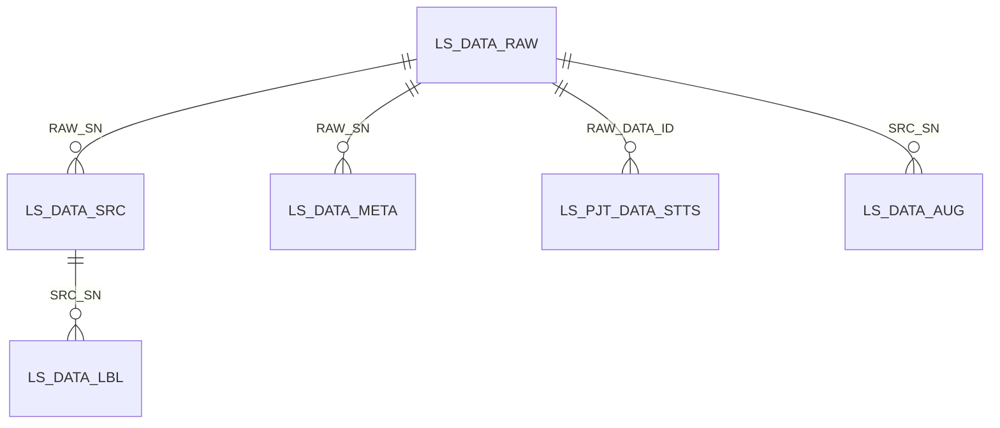

# 관제서버 학습데이터 DB 추출 가이드

> **사업명**: AI 기반 지방정부 CCTV 관제지원시스템 구축(2차)  
> **문서명**: 관제서버 학습데이터 DB 추출 가이드  
> **작성일**: 2026-05-14  
> **관련 문서**: [붙임2] 제안요청서(수정)_260303.hwpx

---

## 1. 목적

본 문서는 관제서버가 저작도구에서 생성·검수한 학습데이터를 공유 DB에서 직접 추출하기 위한 기준을 정의한다.

저작도구는 별도 학습데이터 제공 API를 제공하지 않는다. 관제서버는 동일 `klid_system` DB를 조회해 승인 완료 데이터를 추출한다.

---

## 2. 추출 대상

추출 대상은 검수 승인 완료 영상과 해당 영상에 연결된 프레임, 라벨, 메타, 채택된 증강 결과다.

| 데이터 | 포함 기준 |
|--------|-----------|
| 영상 | 배치와 검수가 완료된 영상 |
| 프레임 | 원본 프레임, 비식별 프레임 |
| 라벨 | 원본 기준 라벨 좌표 |
| 메타 | 검토/수정이 완료된 메타 |
| 증강 | 검수자가 채택한 증강 결과. 기본은 원본 좌표 사용, 해상도 변경 증강은 좌표 재계산 필요 |

---

## 3. 제외 대상

다음 데이터는 추출하지 않는다.

| 조건 | 제외 사유 |
|------|-----------|
| 검수 미완료 | 품질 확정 전 |
| 반려 상태 | 재작업 필요 |
| 비식별 실패 | 개인정보 처리 미완료 |
| 재비식별 잠금 | 비식별 재처리 중 |
| 미해결 비식별 신고 | 개인정보 잔존 가능성 |
| 반려된 증강 결과 | 학습 활용 제외 |

---

## 4. 테이블 관계



| 테이블 | 용도 |
|--------|------|
| `LS_DATA_RAW` | 영상 메타, 원본 영상 경로, 비식별 영상 경로 |
| `LS_DATA_SRC` | 원본/비식별 프레임 경로 |
| `LS_DATA_LBL` | 라벨 유형, 클래스, 좌표, confidence, track id |
| `LS_DATA_META` | 메타 정보 |
| `LS_PJT_DATA_STTS` | 작업/검수 상태 |
| `LS_DATA_AUG` | 증강 결과 |
| `LS_DEIDENT_REPORT` | 비식별 누락 신고 |

---

## 5. 영상 목록 조회

```sql
SELECT
    r.RAW_SN,
    r.VMS_CLIP_ID,
    r.VMS_CCTV_ID,
    r.EVNT_TYPE_CD,
    r.LCLGV_CD,
    r.FILE_PATH      AS RAW_VIDEO_PATH,
    r.DEID_FILE_PATH AS DEID_VIDEO_PATH,
    r.DE_IDNTF_YN,
    r.DATA_STTS_CD,
    r.CAPTURED_AT,
    r.DURATION_SEC
FROM LS_DATA_RAW r
JOIN LS_PJT_DATA_STTS s
  ON s.RAW_DATA_ID = r.RAW_SN
WHERE r.DE_IDNTF_YN = 'Y'
  AND r.LOCK_STTS_CD IS NULL
  AND r.DATA_STTS_CD = 'COMPLETED'
  AND s.DATA_STTS_CD = 'COMPLETED'
  AND NOT EXISTS (
      SELECT 1
      FROM LS_DEIDENT_REPORT dr
      WHERE dr.RAW_SN = r.RAW_SN
        AND dr.STTS_CD = 'OPEN'
  );
```

상태 코드 값은 운영 코드표 기준으로 조정한다.

---

## 6. 프레임 조회

```sql
SELECT
    src.RAW_SN,
    src.FRAME_NO,
    src.FRM_TYPE_CD,
    src.SRC_SN,
    src.FILE_PATH,
    src.CAPTURED_AT
FROM LS_DATA_SRC src
WHERE src.RAW_SN = :rawSn
ORDER BY src.FRAME_NO, src.FRM_TYPE_CD;
```

`FRM_TYPE_CD='RAW'`는 원본 프레임, `FRM_TYPE_CD='DEID'`는 비식별 프레임이다.

---

## 7. 라벨 조회

라벨 좌표는 원본 기준 1벌이다. 비식별 프레임에는 같은 좌표를 적용한다. 증강 결과도 원칙적으로 같은 좌표를 사용한다. 단, 해상도를 낮춘 증강 결과는 원본 이미지 크기와 증강 이미지 크기의 비율에 맞춰 좌표를 재계산해야 한다.

```sql
SELECT
    raw_src.RAW_SN,
    raw_src.FRAME_NO,
    raw_src.SRC_SN  AS RAW_SRC_SN,
    deid_src.SRC_SN AS DEID_SRC_SN,
    lbl.LBL_SN,
    lbl.LBL_TYPE_CD,
    lbl.LABEL,
    lbl.POINTS_JSON,
    lbl.AUTO_LBL_YN,
    lbl.CONF_SCORE,
    lbl.TRACK_ID,
    lbl.LBL_SRC_CD
FROM LS_DATA_SRC raw_src
JOIN LS_DATA_LBL lbl
  ON lbl.SRC_SN = raw_src.SRC_SN
LEFT JOIN LS_DATA_SRC deid_src
  ON deid_src.RAW_SN = raw_src.RAW_SN
 AND deid_src.FRAME_NO = raw_src.FRAME_NO
 AND deid_src.FRM_TYPE_CD = 'DEID'
WHERE raw_src.RAW_SN = :rawSn
  AND raw_src.FRM_TYPE_CD = 'RAW'
ORDER BY raw_src.FRAME_NO, lbl.LBL_SN;
```

---

## 8. 메타 조회

```sql
SELECT
    m.RAW_SN,
    m.META_KEY,
    m.META_VAL,
    m.META_TYPE_CD,
    m.REG_DT,
    m.UPD_DT
FROM LS_DATA_META m
WHERE m.RAW_SN = :rawSn
ORDER BY m.META_TYPE_CD, m.META_KEY;
```

---

## 9. 증강 결과 조회

```sql
SELECT
    a.DATA_AUG_SN,
    a.SRC_SN,
    a.AUG_TYPE_CD,
    a.AUG_PROC_STTS_CD,
    a.LBL_INTGRT_PCT,
    a.DECISION_USER_NO,
    a.DECISION_AT
FROM LS_DATA_AUG a
WHERE a.SRC_SN = :rawSn
  AND a.AUG_PROC_STTS_CD = 'ACCEPTED'
ORDER BY a.AUG_TYPE_CD;
```

---

## 10. 권장 JSON 구조

관제서버가 DB 조회 결과를 JSON으로 변환할 경우 다음 구조를 권장한다.

```json
{
  "rawSn": 1001,
  "video": {
    "rawVideoPath": "/storage/raw/video.mp4",
    "deidVideoPath": "/storage/deidentified/video.mp4",
    "eventTypeCd": "FALL",
    "capturedAt": "2026-05-14T10:00:00"
  },
  "frames": [
    {
      "frameNo": 0,
      "rawFramePath": "/storage/raw/frames/1001/frame-0.jpg",
      "deidFramePath": "/storage/deidentified/frames/1001/frame-0.jpg",
      "labels": [
        {
          "type": "BBOX",
          "label": "person",
          "points": [[10, 20], [110, 220]],
          "confidence": 0.91,
          "trackId": "1"
        }
      ]
    }
  ],
  "metadata": {},
  "augmentations": []
}
```

필드명은 관제서버 내부 규격에 맞춰 조정할 수 있다. 단, 원본/비식별 경로 분리와 라벨 좌표 1벌 정책은 유지한다. 증강 데이터 JSON을 생성할 때는 증강 유형을 확인한다. 원본과 동일 해상도인 증강 결과는 원본 좌표를 그대로 사용할 수 있고, 해상도 변경 증강은 재계산된 좌표를 사용해야 한다.

---

## 11. 운영 주의사항

- DB 조회는 읽기 전용 계정 사용을 권장한다.
- 대량 추출은 `RAW_SN`, 등록일, 승인 완료일 기준으로 나누어 처리한다.
- 파일 경로는 DB 값을 사용하고 사용자 입력으로 조합하지 않는다.
- 상태 코드 값은 운영 코드표와 맞춰 확인한다.
- 미해결 비식별 신고가 있는 데이터는 추출하지 않는다.
