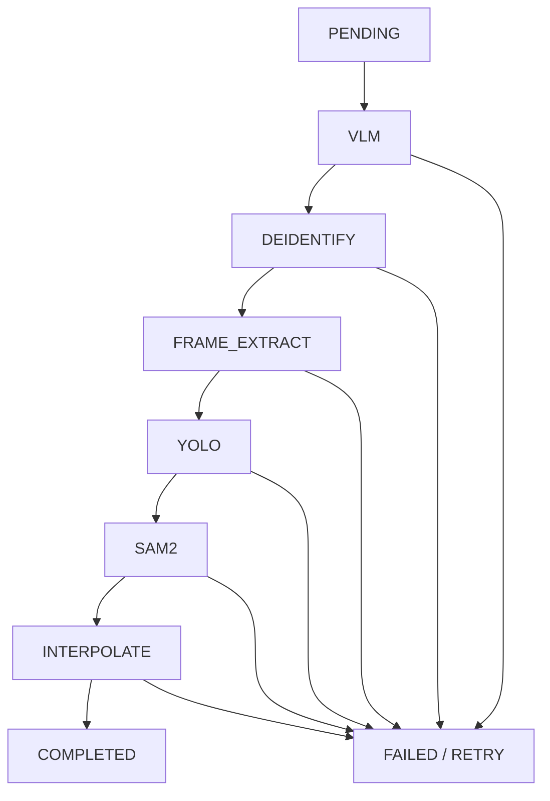

# 학습데이터 저작도구 요구사항 정의서

> **사업명**: AI 기반 지방정부 CCTV 관제지원시스템 구축(2차)  
> **문서명**: 학습데이터 저작도구 요구사항 정의서  
> **작성일**: 2026-05-14  
> **관련 문서**: [붙임2] 제안요청서(수정)_260303.hwpx

---

## 1. 문서 개요

### 1.1 목적

본 문서는 AI 기반 지방정부 CCTV 관제지원시스템 구축(2차) 사업 중 학습데이터 저작도구의 기능 범위, 처리 흐름, 사용자 권한, 외부 연동 원칙, 학습데이터 추출 방식을 정의한다.

저작도구는 관제서버가 라벨링 대상으로 판별한 영상 데이터를 받아 학습데이터 제작에 필요한 전처리, 오토라벨링, 라벨 수정, 검수, 버전관리, 비식별 누락 신고, 포털 간편 라벨링 기능을 제공한다.

### 1.2 적용 범위

| 구분 | 범위 |
|------|------|
| 내부 채널 | 관제서버에서 세션을 인계받은 검수자와 작업자 업무 |
| 포털 채널 | 포털 서버에서 세션을 인계받은 포털 회원의 업로드 및 간편 라벨링 |
| 배치 처리 | VLM, 비식별, 프레임 추출, YOLO, SAM2, 보간 |
| 데이터 관리 | 원본/비식별 영상 및 프레임, 라벨, 메타, 이력, 검수 상태 |
| 학습데이터 추출 | 관제서버가 공유 DB에서 승인 완료 데이터를 직접 추출 |

### 1.3 제외 범위

| 항목 | 제외 사유 |
|------|-----------|
| 저작도구 독립 로그인 | 관제서버/포털 서버 JWT 인계 방식 사용 |
| 외부 학습데이터 제공 API | 관제서버가 동일 DB를 직접 조회 |
| 데이터마트 구축/검색/다운로드 | 별도 외부제공 시스템 책임 |
| 포털 다운로드 기능 | 포털 자체 책임 |
| 외부 업체 API 상세 명세 | 외부 업체 개발 완료 후 별도 협의 필요 |

---

## 2. 사용자와 권한

저작도구의 역할은 세 가지로 구분한다.

| 역할 | 코드 | 주요 권한 |
|------|------|-----------|
| 검수자 | `REVIEWER` | 사용자 관리, 시스템 설정, 작업 배정, 검수 승인/반려, 증강 결과 검수, 전체 통계 조회, 라벨 롤백 |
| 작업자 | `WORKER` | 본인 배정 작업 조회, 라벨 수정, 검수 제출, 개인 통계 조회 |
| 포털 회원 | `PORTAL_USER` | 본인 업로드 데이터 조회, 오토라벨링 체험, 간편 라벨링 |

시스템 관리자 역할은 별도로 두지 않는다. 관리 권한은 검수자에게 통합한다.

---

## 3. 인증과 진입

저작도구는 별도 로그인 화면을 제공하지 않는다.

| 채널 | 진입 방식 | 만료 처리 |
|------|-----------|-----------|
| 내부 채널 | 관제서버가 발급한 JWT 인계 | 관제서버 로그인 페이지로 이동 |
| 포털 채널 | 포털 서버가 발급한 JWT 인계 | 포털 로그인 페이지로 이동 |

JWT에는 사용자 식별자, 역할, 채널 정보가 포함되어야 한다. 저작도구는 해당 클레임을 기준으로 메뉴, 화면, API 접근 권한을 제어한다.

---

## 4. 배치 파이프라인

### 4.1 처리 순서

라벨링 대상 영상은 다음 순서로 처리한다.

### 4.2 단계별 기능

| 단계 | 기능 |
|------|------|
| VLM | 영상 단위 메타 처리. 외부 시계열 메타가 생성된 경우 저작도구에서 검토/수정한다 |
| DEIDENTIFY | 원본 영상을 외부 비식별 시스템에 전달해 비식별 영상을 생성한다 |
| FRAME_EXTRACT | 원본 영상과 비식별 영상에서 각각 프레임을 추출한다 |
| YOLO | 원본 프레임 기준으로 객체 bbox와 track id를 생성한다 |
| SAM2 | YOLO 결과를 기반으로 segmentation polygon을 생성한다 |
| INTERPOLATE | 동일 track id의 누락 프레임 라벨을 보간한다 |

### 4.3 비식별 처리 원칙

비식별은 영상 단위로 수행한다. 원본 영상 파일을 입력으로 외부 비식별 시스템을 호출하고, 결과는 비식별 영상 파일로 저장한다.

비식별 완료 후 프레임 추출을 수행한다. 원본 영상에서 추출한 프레임과 비식별 영상에서 추출한 프레임은 모두 보관한다.

라벨 좌표는 원본 기준 1벌만 유지한다. 비식별 영상과 프레임은 객체 위치가 동일하다는 전제에서 동일 좌표를 적용한다. 증강 데이터도 같은 원칙을 따른다. 단, 해상도를 낮추는 증강 결과는 원본 해상도와 증강 결과 해상도 비율에 맞춰 좌표를 재계산한다.

### 4.4 실패와 재처리

비식별 실패 시 원본 영상은 삭제하거나 덮어쓰지 않는다. 실패 상태를 기록하고 재처리 대상에 포함한다.

작업자가 비식별 프레임에서 개인정보 잔존을 발견하면 비식별 누락 신고를 등록할 수 있다. 신고된 영상은 재비식별 잠금 상태로 전환되며, 재비식별이 완료될 때까지 라벨 저장과 검수 제출을 제한한다.

---

## 5. 라벨링

작업자는 본인에게 배정된 프레임만 수정할 수 있다. 검수자는 전체 프레임을 조회하고 검수할 수 있다.

| 사용자 | 기본 화면 | 원본 보기 |
|--------|-----------|-----------|
| 작업자 | 비식별 프레임 | 불가 |
| 검수자 | 비식별 프레임 | 가능 |

지원 라벨 유형은 bbox, polygon, segmentation을 기본으로 한다. 자동 생성 라벨과 수동 수정 라벨은 구분해서 저장한다.

---

## 6. 검수

작업자는 라벨 수정 후 검수 제출을 수행한다. 검수자는 제출된 작업을 확인하고 승인 또는 반려한다.

| 상태 | 설명 |
|------|------|
| 작업 중 | 작업자가 라벨을 수정하는 상태 |
| 검수 대기 | 작업자가 검수 제출한 상태 |
| 검수 중 | 검수자가 확인 중인 상태 |
| 승인 | 학습데이터 추출 대상에 포함 가능한 상태 |
| 반려 | 작업자 재작업이 필요한 상태 |

반려 시 검수자는 사유를 입력해야 하며, 반려 이력은 추적 가능해야 한다.

---

## 7. 버전관리와 롤백

라벨 저장 시점마다 라벨링 데이터 snapshot을 저장하고 Gitea commit 이력을 남긴다.

검수자는 특정 저장 시점을 선택해 라벨링 데이터를 해당 시점으로 롤백할 수 있다. 롤백은 화면 표시만 바꾸는 기능이 아니라 현재 라벨 데이터를 이전 저장 시점의 데이터로 복원하는 기능이다.

롤백 실행 자체도 새 이력으로 저장한다.

---

## 8. 증강 결과 검수

데이터 증강 결과는 검수자가 확인하고 학습데이터 활용 여부를 결정한다.

| 결정 | 처리 |
|------|------|
| 채택 | 학습데이터 추출 대상에 포함 |
| 반려 | 학습데이터 추출 대상에서 제외, 반려 사유 기록 |

증강 유형, 라벨 무결성 점수, 결정 사용자, 결정 일시는 추적 가능해야 한다.

증강 데이터는 원본 라벨 좌표를 동일하게 사용하는 것을 기본으로 한다. 다만 해상도 변경 증강처럼 결과 이미지 크기가 원본과 달라지는 경우에는 좌표를 재계산해야 한다.

---

## 9. 포털 기능

포털 채널은 체험과 간편 라벨링 목적의 제한된 기능만 제공한다.

| 기능 | 내용 |
|------|------|
| 업로드 | 포털 사용자의 영상 업로드 |
| 업로드 검증 | 확장자, MIME, 파일 크기 제한 |
| 오토라벨링 체험 | 업로드 데이터에 대한 자동 라벨 생성 |
| 간편 라벨링 | 본인 업로드 데이터 범위에서 라벨 수정 |

포털 채널에는 검수, Gitea 버전관리, 롤백, 다운로드 기능을 제공하지 않는다.

---

## 10. 외부 연동 원칙

외부 업체 시스템의 상세 API는 업체 개발 완료 후 협의한다. 본 문서에서는 입출력 원칙만 정의한다.

| 연동 대상 | 원칙 |
|-----------|------|
| 외부 비식별 시스템 | 원본 영상 입력, 비식별 영상 출력 |
| 외부 생성/증강 시스템 | 저작도구는 요청과 결과 검수 흐름을 제공 |
| 외부 시계열 메타 시스템 | 저작도구는 생성된 메타를 검토/수정 |

URL, 인증 방식, 요청/응답 필드, 에러 코드는 별도 연동 규격으로 확정한다.

---

## 11. 학습데이터 추출

저작도구는 외부 학습데이터 제공 API를 별도로 제공하지 않는다. 관제서버는 동일 DB를 조회해 승인 완료 데이터를 직접 추출한다.

저작도구는 관제서버가 데이터를 추출할 수 있도록 다음 기준을 제공한다.

| 항목 | 기준 |
|------|------|
| 영상 | 원본 영상, 비식별 영상 |
| 프레임 | 원본 프레임, 비식별 프레임 |
| 라벨 | 원본 기준 좌표 1벌 |
| 메타 | 검토/수정이 완료된 메타 |
| 증강 | 채택된 증강 결과. 기본은 원본 좌표 사용, 해상도 변경 증강은 좌표 재계산 |
| 제외 | 검수 미완료, 반려, 비식별 실패, 재비식별 잠금, 반려된 증강 |
